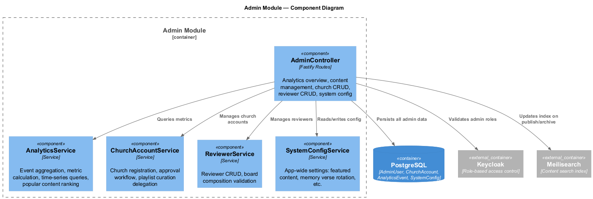
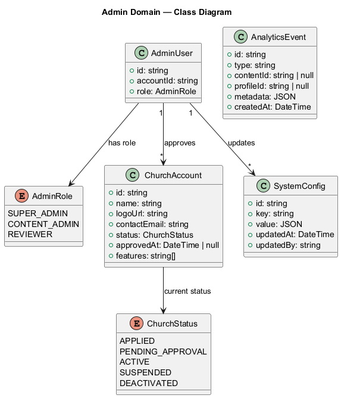
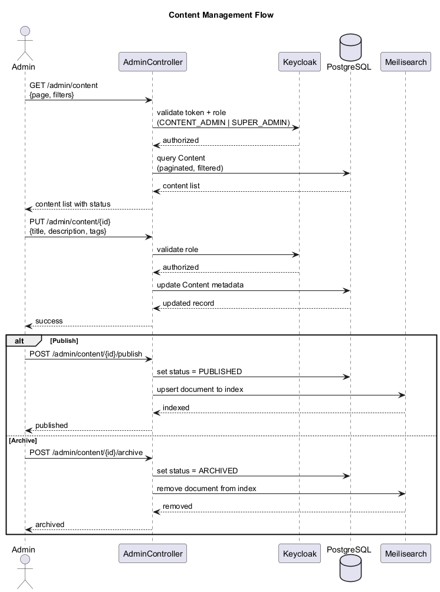
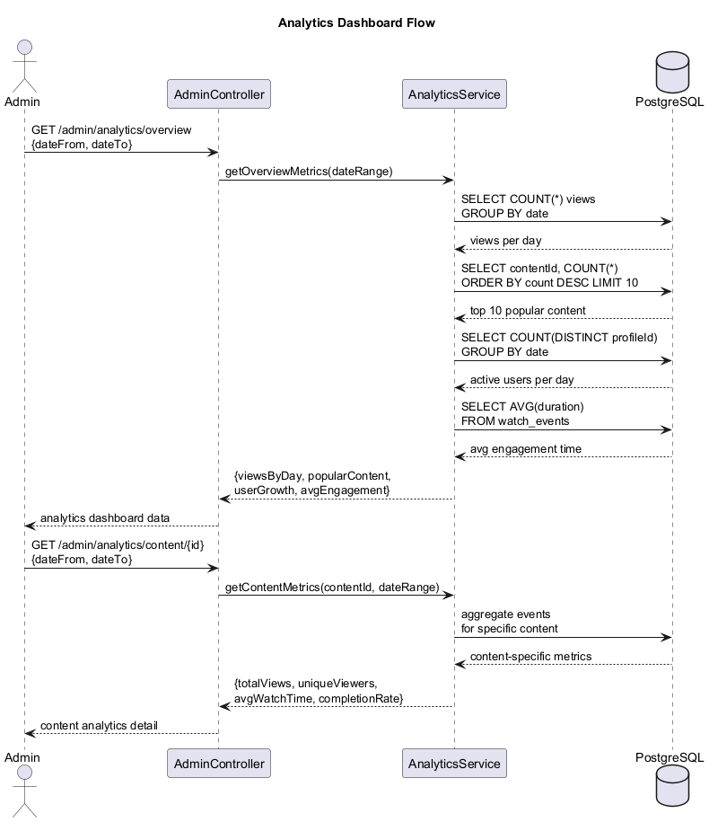
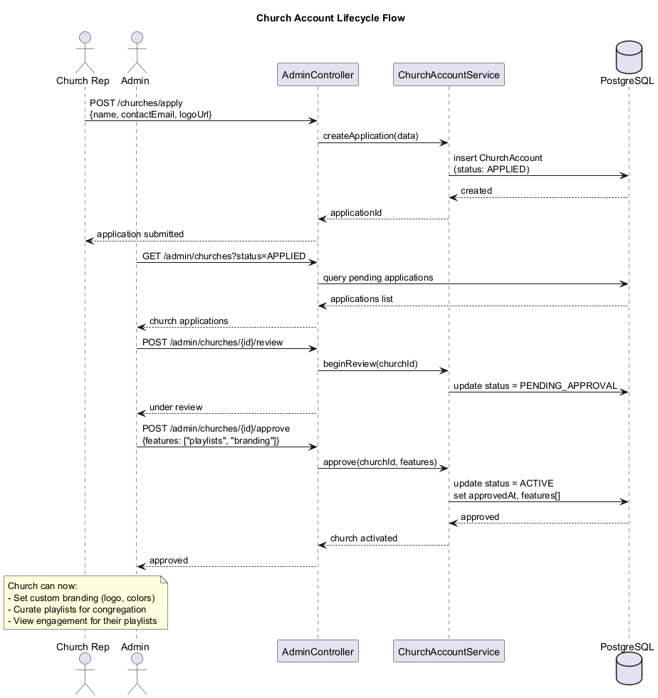
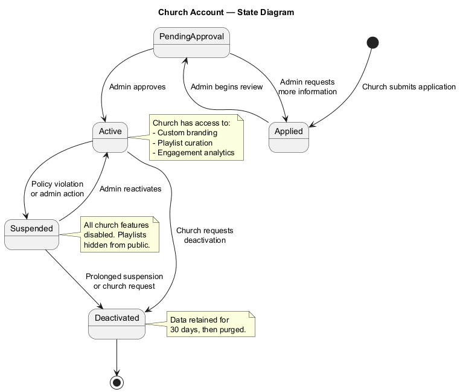

# Admin Subsystem — Detailed Design

## Overview

The Admin subsystem provides the management dashboard for LightHouse Kids, enabling platform administrators to manage content, view analytics, oversee church/organization accounts, manage the review board, and configure system-wide settings. Access is controlled through Keycloak role-based authentication with three distinct admin roles.

### Key Capabilities

- **Content management** — Full CRUD operations on content items with publish/archive workflows. Publishing triggers Meilisearch index updates so content becomes discoverable.
- **Analytics dashboard** — Aggregated views of platform usage including views per day, popular content rankings, user growth trends, and engagement metrics (average watch time, completion rate).
- **Church/organization accounts** — Churches can apply for accounts, which admins review and approve. Approved churches gain access to custom branding and playlist curation for their congregations.
- **Reviewer management** — Add, remove, and manage review board members who evaluate submitted content before publication.
- **System configuration** — App-wide settings such as featured content selection, memory verse rotation schedules, and other operational parameters.

---

## Architecture Diagrams

### Component Diagram

Shows the internal structure of the admin module and its dependencies.

---

## Domain Model

### Class Diagram

### Entities and Types

#### `AdminUser`

Represents an administrator with role-based permissions.

| Field       | Type        | Description                          |
|------------|-------------|--------------------------------------|
| `id`       | `string`    | Unique identifier (UUID)             |
| `accountId`| `string`    | FK to the parent Account in Keycloak |
| `role`     | `AdminRole` | Permission level                     |

#### `AdminRole` (enum)

| Value           | Permissions                                                         |
|----------------|----------------------------------------------------------------------|
| `SUPER_ADMIN`  | Full platform access, system config, church approval, reviewer mgmt  |
| `CONTENT_ADMIN`| Content CRUD, publish/archive, view analytics                        |
| `REVIEWER`     | Review submitted content, approve/reject                             |

#### `ChurchAccount`

Represents a church or organization with a branded presence on the platform.

| Field          | Type           | Description                                 |
|---------------|----------------|---------------------------------------------|
| `id`          | `string`       | Unique identifier (UUID)                    |
| `name`        | `string`       | Church display name                         |
| `logoUrl`     | `string`       | URL to uploaded church logo                 |
| `contactEmail`| `string`       | Primary contact email                       |
| `status`      | `ChurchStatus` | Current lifecycle state                     |
| `approvedAt`  | `DateTime`     | When the account was approved (null if not) |
| `features`    | `string[]`     | Enabled features (playlists, branding, etc.)|

#### `ChurchStatus` (enum)

Values: `APPLIED`, `PENDING_APPROVAL`, `ACTIVE`, `SUSPENDED`, `DEACTIVATED`

#### `AnalyticsEvent`

A single tracked event used for aggregation and reporting.

| Field       | Type     | Description                                  |
|------------|----------|----------------------------------------------|
| `id`       | `string` | Unique identifier (UUID)                     |
| `type`     | `string` | Event type (e.g., `view`, `complete`, `share`)|
| `contentId`| `string` | FK to Content (nullable for non-content events)|
| `profileId`| `string` | FK to child Profile (nullable)               |
| `metadata` | `JSON`   | Flexible payload (duration, device, etc.)    |
| `createdAt`| `DateTime`| When the event occurred                      |

#### `SystemConfig`

Key-value store for platform-wide configuration.

| Field       | Type       | Description                        |
|------------|------------|------------------------------------|
| `id`       | `string`   | Unique identifier (UUID)           |
| `key`      | `string`   | Configuration key (unique)         |
| `value`    | `JSON`     | Configuration value                |
| `updatedAt`| `DateTime` | Last modification timestamp        |
| `updatedBy`| `string`   | FK to AdminUser who last updated   |

---

## Service Layer

### `AdminController`

Fastify route handler for all admin operations.

| Endpoint                                | Method | Description                          |
|-----------------------------------------|--------|--------------------------------------|
| `/admin/analytics/overview`             | GET    | Dashboard metrics with date filters  |
| `/admin/analytics/content/:id`          | GET    | Per-content analytics detail         |
| `/admin/content`                        | GET    | Paginated content list with filters  |
| `/admin/content/:id`                    | PUT    | Update content metadata              |
| `/admin/content/:id/publish`            | POST   | Publish content, update search index |
| `/admin/content/:id/archive`            | POST   | Archive content, remove from index   |
| `/admin/churches`                       | GET    | List church accounts (filterable)    |
| `/admin/churches/:id/approve`           | POST   | Approve a church application         |
| `/admin/churches/:id/suspend`           | POST   | Suspend a church account             |
| `/admin/reviewers`                      | GET    | List review board members            |
| `/admin/reviewers`                      | POST   | Add a reviewer                       |
| `/admin/reviewers/:id`                  | DELETE | Remove a reviewer                    |
| `/admin/config`                         | GET    | List all system configuration        |
| `/admin/config/:key`                    | PUT    | Update a configuration value         |

### `AnalyticsService`

Handles all analytics computation.

- **Event aggregation** — Groups `AnalyticsEvent` records by type, date, content, and profile.
- **Time-series queries** — Returns data points for charting (views/day, users/day).
- **Popular content ranking** — Orders content by view count within a date range.
- **Engagement metrics** — Calculates average watch time, completion rate, and session duration.

### `ChurchAccountService`

Manages the church account lifecycle.

- **Registration** — Creates a new `ChurchAccount` with `APPLIED` status.
- **Approval workflow** — Transitions through `PENDING_APPROVAL` to `ACTIVE`, granting selected features.
- **Suspension/deactivation** — Disables church features and hides playlists.
- **Playlist curation delegation** — Active churches can create curated playlists visible to their congregation.

### `ReviewerService`

Manages the content review board.

- **CRUD operations** — Add and remove reviewers from the board.
- **Board composition validation** — Ensures minimum board size requirements are met.
- **Role assignment** — Creates Keycloak role mappings for reviewer accounts.

### `SystemConfigService`

Manages app-wide settings.

- **Featured content** — Which content appears on the home screen carousel.
- **Memory verse rotation** — Schedule and selection of daily/weekly memory verses.
- **Maintenance mode** — Toggle platform availability.
- **Configuration history** — Tracks who changed what and when via `updatedBy`.

---

## Sequence Diagrams

### Content Management

Admin workflow for editing, publishing, and archiving content.

### Analytics Dashboard

How analytics data is aggregated and returned to the admin UI.

### Church Account Lifecycle

From application through approval to feature access.

---

## State Diagram

### Church Account Lifecycle

Churches progress from application through review to activation. Suspended churches can be reactivated by an admin. Deactivated accounts have their data retained for 30 days before purging.

---

## Authorization Matrix

| Action                  | SUPER_ADMIN | CONTENT_ADMIN | REVIEWER |
|------------------------|:-----------:|:-------------:|:--------:|
| View analytics         | Yes         | Yes           | No       |
| Manage content         | Yes         | Yes           | No       |
| Publish/archive        | Yes         | Yes           | No       |
| Review content         | Yes         | Yes           | Yes      |
| Manage churches        | Yes         | No            | No       |
| Manage reviewers       | Yes         | No            | No       |
| System configuration   | Yes         | No            | No       |
