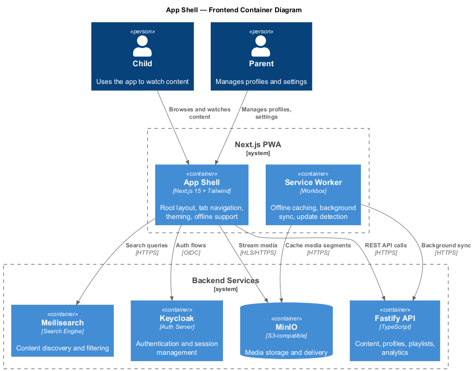
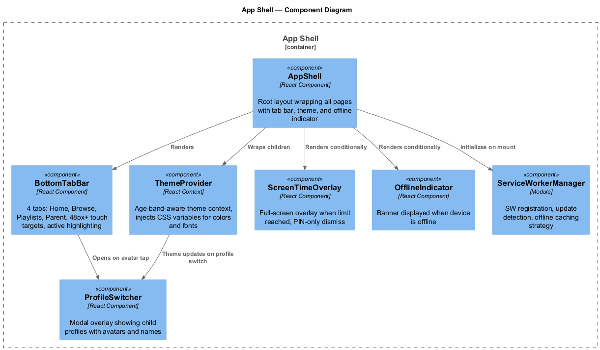
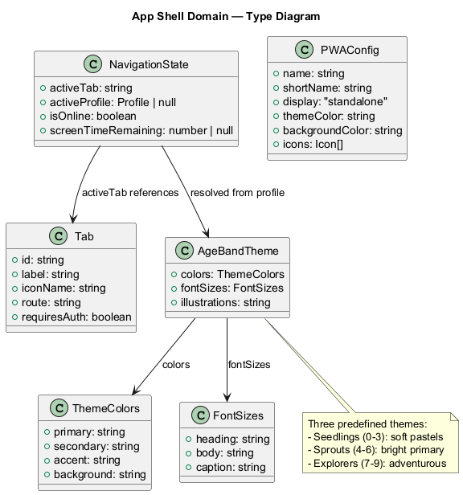
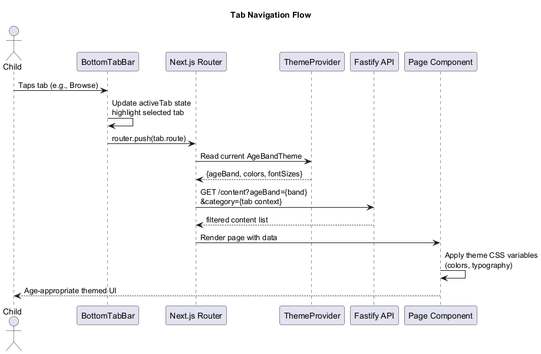
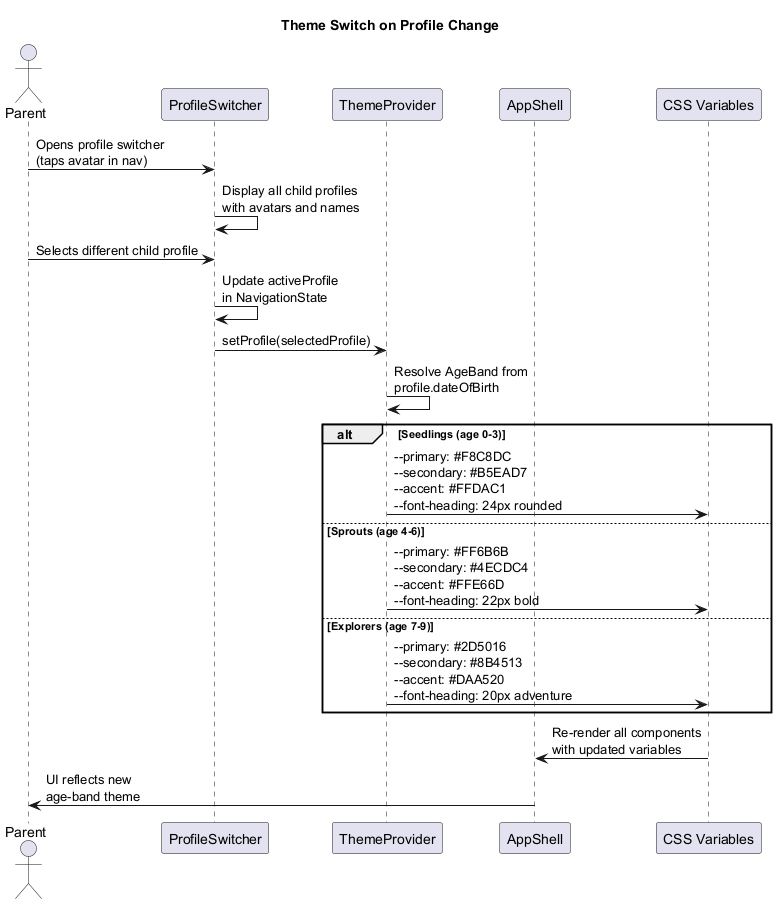
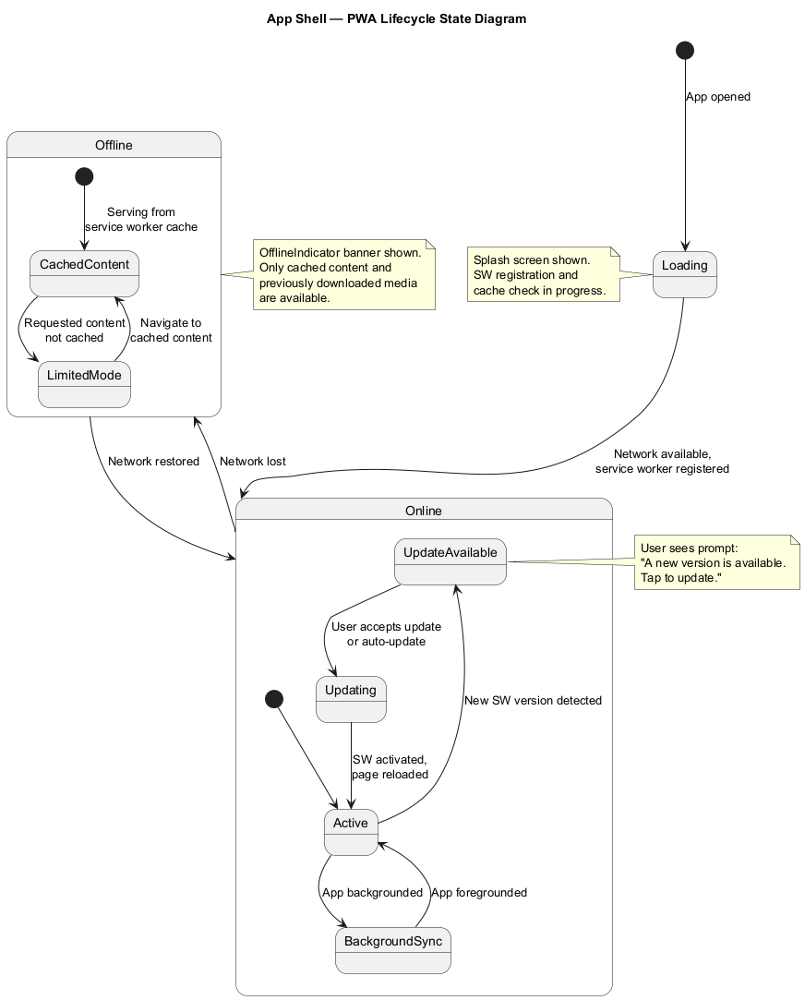

# App Shell — Detailed Design

## Overview

The App Shell is the root UI framework for the LightHouse Kids PWA. It provides the persistent navigation structure, age-band theming, profile switching, offline awareness, and screen time enforcement that wrap every page in the application. Built with Next.js 15 and Tailwind CSS, the shell follows a mobile-first responsive design optimized for touch interaction by young children.

### Key Capabilities

- **Bottom tab bar** — Four tabs (Home, Browse, Playlists, Parent) with large 48px+ touch targets, active state highlighting, and a lock icon on the Parent tab to indicate it requires PIN access.
- **Profile switcher** — Accessible from the navigation bar, displays all child profiles as avatar cards in a modal overlay. Switching profiles changes the active age band and theme.
- **Age-band theming** — Three distinct visual themes automatically applied based on the child's age:
  - **Seedlings (0-3):** Soft pastels, large rounded typography, gentle illustrations
  - **Sprouts (4-6):** Bright primary colors, bold playful typography
  - **Explorers (7-9):** Adventurous earth tones, slightly more mature typography
- **PWA support** — Full Progressive Web App with manifest, service worker, installability, and offline-first caching strategy.
- **Offline indicator** — A banner displayed when the device loses connectivity, informing users that only cached content is available.
- **Screen time overlay** — Full-screen overlay that appears when a child's screen time limit is reached. Displays a friendly message and can only be dismissed with the parent PIN.

---

## Architecture Diagrams

### Frontend Container Diagram

Shows how the Next.js PWA connects to all backend services.



### Shell Component Diagram

Internal components of the App Shell and their relationships.



---

## Domain Model

### Type Diagram



### Types and Interfaces

#### `Tab`

Defines a single bottom tab bar entry.

| Field          | Type      | Description                                   |
|---------------|-----------|-----------------------------------------------|
| `id`          | `string`  | Unique tab identifier                         |
| `label`       | `string`  | Display label (e.g., "Home", "Browse")        |
| `iconName`    | `string`  | Icon identifier for the tab                   |
| `route`       | `string`  | Next.js route path                            |
| `requiresAuth`| `boolean` | Whether the tab requires parent authentication|

**Default tabs:**

| Tab       | Icon          | Route        | Auth Required |
|-----------|---------------|--------------|:-------------:|
| Home      | `home`        | `/`          | No            |
| Browse    | `search`      | `/browse`    | No            |
| Playlists | `playlist`    | `/playlists` | No            |
| Parent    | `lock`        | `/parent`    | Yes           |

#### `AgeBandTheme`

Theme configuration resolved from the active child's age band.

| Field          | Type          | Description                            |
|---------------|---------------|----------------------------------------|
| `colors`      | `ThemeColors` | Primary, secondary, accent, background |
| `fontSizes`   | `FontSizes`   | Heading, body, caption sizes           |
| `illustrations`| `string`     | Illustration style identifier          |

**Theme palettes:**

| Age Band    | Primary   | Secondary | Accent    | Background |
|------------|-----------|-----------|-----------|------------|
| Seedlings  | `#F8C8DC` | `#B5EAD7` | `#FFDAC1` | `#FFF9F0`  |
| Sprouts    | `#FF6B6B` | `#4ECDC4` | `#FFE66D` | `#FFFEF0`  |
| Explorers  | `#2D5016` | `#8B4513` | `#DAA520` | `#F5F0E8`  |

#### `NavigationState`

Global navigation state managed by the App Shell.

| Field                 | Type             | Description                          |
|----------------------|------------------|--------------------------------------|
| `activeTab`          | `string`         | Currently selected tab ID            |
| `activeProfile`      | `Profile | null` | Currently active child profile       |
| `isOnline`           | `boolean`        | Network connectivity status          |
| `screenTimeRemaining`| `number | null`  | Seconds remaining (null = unlimited) |

#### `PWAConfig`

Manifest and service worker configuration.

| Field             | Type         | Description                       |
|------------------|--------------|-----------------------------------|
| `name`           | `string`     | `"LightHouse Kids"`               |
| `shortName`      | `string`     | `"LightHouse"`                    |
| `display`        | `string`     | `"standalone"`                    |
| `themeColor`     | `string`     | Dynamic based on active age band  |
| `backgroundColor`| `string`     | Dynamic based on active age band  |
| `icons`          | `Icon[]`     | App icons at various sizes        |

---

## Component Details

### `AppShell`

The root layout component rendered on every page.

```
<AppShell>
  <ThemeProvider>
    <OfflineIndicator />
    <ScreenTimeOverlay />
    <main>{children}</main>
    <BottomTabBar />
  </ThemeProvider>
</AppShell>
```

Responsibilities:
- Wraps all page content with the theme provider
- Conditionally renders the offline indicator and screen time overlay
- Initializes the `ServiceWorkerManager` on mount
- Manages global `NavigationState`

### `BottomTabBar`

Fixed-position bottom navigation with four tabs.

- Touch targets are at least 48x48px for child-friendly interaction
- Active tab is highlighted with the theme's primary color
- Parent tab shows a lock icon to signal PIN protection
- Profile avatar button in the top-right opens the `ProfileSwitcher`

### `ProfileSwitcher`

Modal overlay for switching between child profiles.

- Shows all child profiles associated with the parent account
- Each profile displays the child's avatar, name, and age band badge
- Selecting a profile updates `NavigationState.activeProfile` and triggers a theme switch
- Accessible from the navigation bar avatar

### `ThemeProvider`

React context provider that manages age-band theming.

- Reads the active profile's age band (Seedlings, Sprouts, Explorers)
- Injects CSS custom properties (`--primary`, `--secondary`, `--accent`, `--bg`, `--font-heading`, etc.)
- All downstream components use these CSS variables for consistent theming
- Theme transitions are animated for a smooth visual experience

### `ScreenTimeOverlay`

Full-screen blocking overlay shown when screen time is exhausted.

- Covers the entire viewport with a semi-transparent backdrop
- Displays a friendly, age-appropriate message (e.g., "Time for a break!")
- Can only be dismissed by entering the parent PIN
- Timer countdown shown if time is about to expire (last 5 minutes warning)

### `OfflineIndicator`

Non-intrusive banner at the top of the screen.

- Shown when `navigator.onLine` is false or service worker reports no connectivity
- Message: "You're offline. Only downloaded content is available."
- Auto-dismisses when connectivity is restored

### `ServiceWorkerManager`

Module (not a visual component) that handles PWA lifecycle.

- Registers the service worker on app mount
- Detects available updates and prompts the user
- Implements caching strategy: network-first for API calls, cache-first for media assets
- Manages offline content availability
- Handles background sync for deferred operations (e.g., analytics events)

---

## Sequence Diagrams

### Tab Navigation

How tapping a tab navigates, fetches age-filtered content, and renders with the active theme.



### Theme Switch on Profile Change

What happens when a parent switches the active child profile.



---

## State Diagram

### PWA App Lifecycle

Shows the app states including online, offline, background sync, and update flows.



The app starts in a loading state while the service worker registers. Once online, it operates normally with background sync when backgrounded. If an update is detected, the user is prompted. When offline, only cached and downloaded content is available, with an indicator banner shown.

---

## Responsive Layout

The app shell uses a mobile-first responsive approach:

| Breakpoint    | Layout                                          |
|--------------|--------------------------------------------------|
| < 640px      | Full-width single column, bottom tab bar         |
| 640-1024px   | Centered content (max 640px), bottom tab bar     |
| > 1024px     | Sidebar navigation replaces bottom tabs, 2-column|

## Accessibility

- All touch targets meet WCAG minimum of 44x44px (we use 48px+)
- Color contrast ratios meet AA standards for all three age-band themes
- Tab bar supports keyboard navigation for accessibility devices
- Screen reader labels on all icons and interactive elements
- Reduced motion support respects `prefers-reduced-motion`
