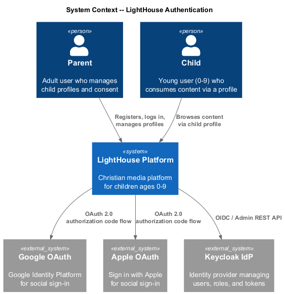
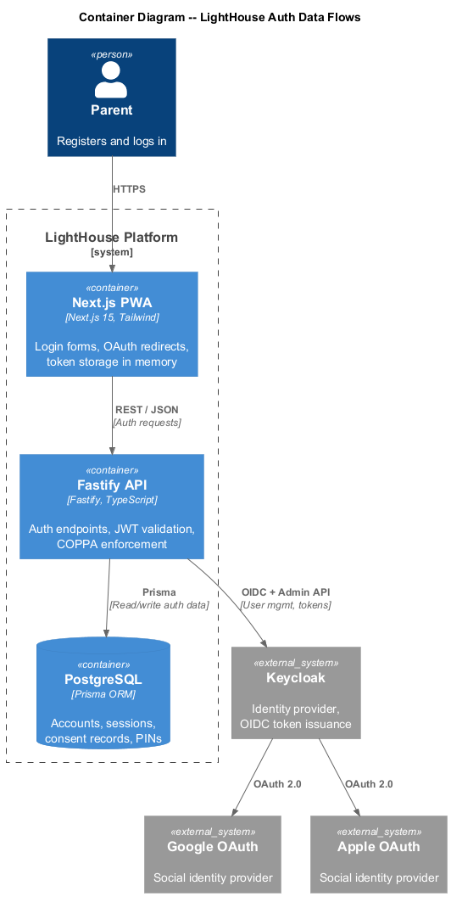
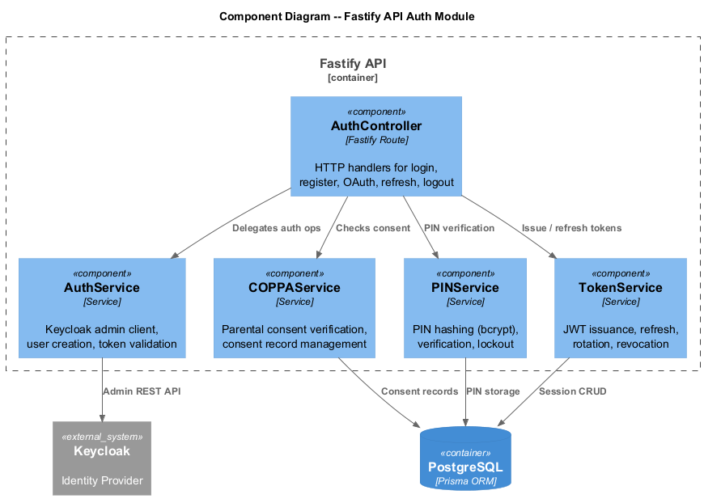
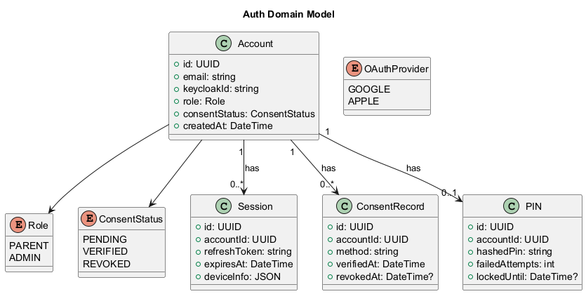
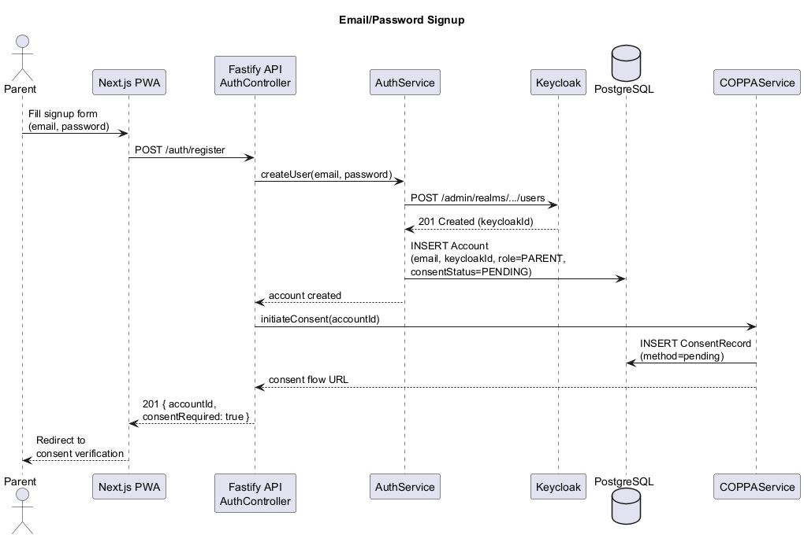
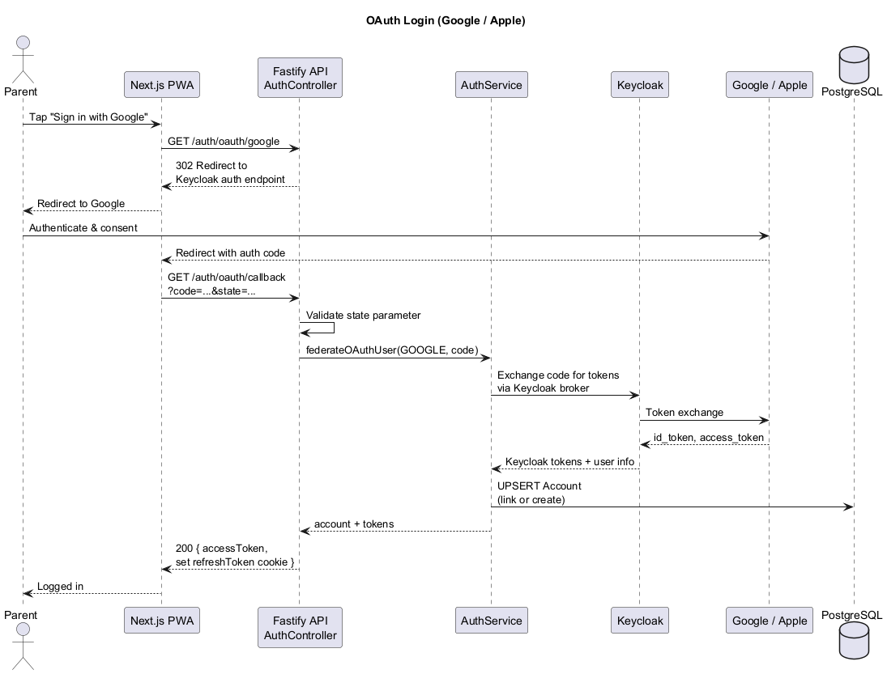
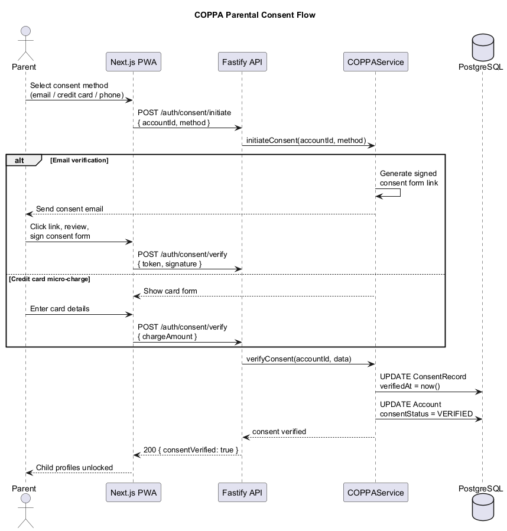
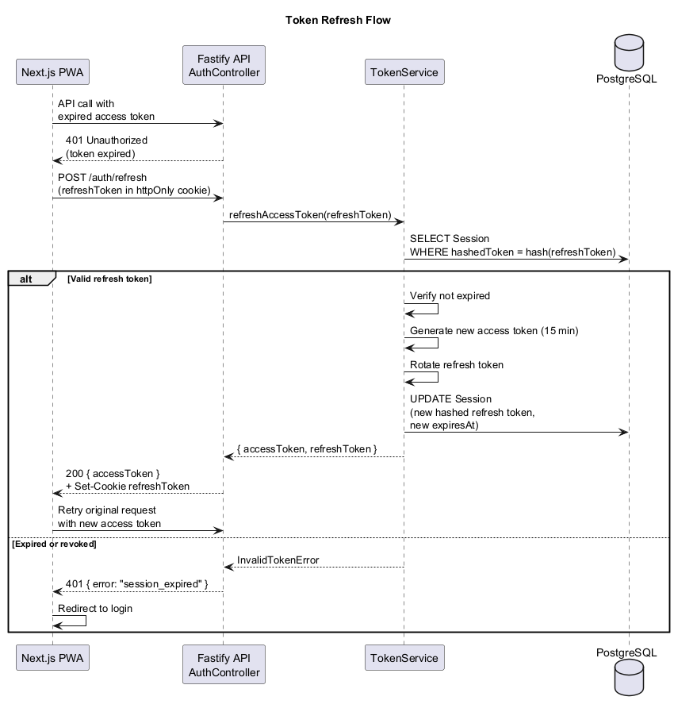
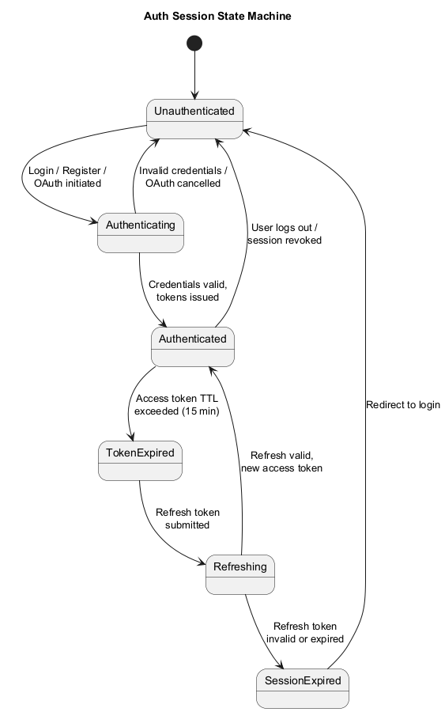
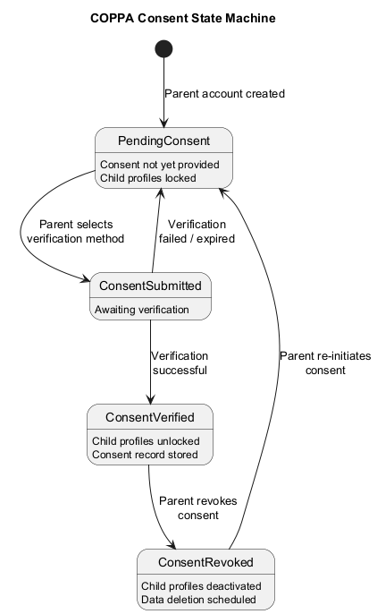

# Authentication & Authorization -- Detailed Design

## 1. Overview

The Authentication & Authorization module handles all identity, access, and session management for the LightHouse Kids platform. It integrates with **Keycloak** as the identity provider, supports **OAuth 2.0** social login (Google, Apple), traditional **email/password** signup, and enforces **COPPA** parental-consent requirements before child profiles can be created.

Key capabilities:

- Keycloak-backed identity store with federated social providers.
- JWT-based session lifecycle (access + refresh tokens).
- COPPA-compliant parental consent verification and record-keeping.
- PIN management for quick in-app profile switching and parental gates.
- Device-aware session tracking with revocation support.

---

## 2. Architecture Diagrams

### 2.1 System Context (C4 Level 1)

Shows the external actors and systems that interact with LightHouse authentication.

### 2.2 Container Diagram (C4 Level 2)

Illustrates the containers involved in the auth data flow -- the PWA frontend, API backend, Keycloak, and PostgreSQL.

### 2.3 API Auth Components (C4 Level 3)

Breaks down the Fastify API auth module into its constituent components.

---

## 3. Domain Model

### 3.1 Class Diagram

### 3.2 Entities

#### Account

| Field         | Type           | Description                              |
|---------------|----------------|------------------------------------------|
| id            | UUID           | Primary key                              |
| email         | string         | Unique email address                     |
| keycloakId    | string         | Corresponding Keycloak user ID           |
| role          | Role           | PARENT or ADMIN                          |
| consentStatus | ConsentStatus  | PENDING, VERIFIED, or REVOKED            |
| createdAt     | DateTime       | Account creation timestamp               |

#### Session

| Field        | Type     | Description                              |
|--------------|----------|------------------------------------------|
| id           | UUID     | Primary key                              |
| accountId    | UUID     | FK to Account                            |
| refreshToken | string   | Hashed refresh token                     |
| expiresAt    | DateTime | Refresh token expiry                     |
| deviceInfo   | JSON     | User-agent, platform, device fingerprint |

#### ConsentRecord

| Field      | Type     | Description                        |
|------------|----------|------------------------------------|
| id         | UUID     | Primary key                        |
| accountId  | UUID     | FK to Account                      |
| method     | string   | "email", "credit_card", "phone"    |
| verifiedAt | DateTime | When consent was verified          |
| revokedAt  | DateTime | Nullable; when consent was revoked |

#### PIN

| Field          | Type     | Description                        |
|----------------|----------|------------------------------------|
| id             | UUID     | Primary key                        |
| accountId      | UUID     | FK to Account                      |
| hashedPin      | string   | bcrypt hash of the 4-6 digit PIN   |
| failedAttempts | int      | Counter for brute-force protection |
| lockedUntil    | DateTime | Nullable; lockout expiry           |

### 3.3 Enums

- **Role**: `PARENT`, `ADMIN`
- **ConsentStatus**: `PENDING`, `VERIFIED`, `REVOKED`
- **OAuthProvider**: `GOOGLE`, `APPLE`

---

## 4. Components

### 4.1 AuthController

HTTP handler layer exposing auth endpoints:

| Endpoint                    | Method | Description                        |
|-----------------------------|--------|------------------------------------|
| `/auth/register`            | POST   | Email/password registration        |
| `/auth/login`               | POST   | Email/password login               |
| `/auth/oauth/:provider`     | GET    | Initiate OAuth redirect            |
| `/auth/oauth/callback`      | GET    | Handle OAuth callback              |
| `/auth/refresh`             | POST   | Refresh access token               |
| `/auth/logout`              | POST   | Invalidate session                 |

### 4.2 AuthService

Wraps the Keycloak Admin REST API:

- `createUser(email, password)` -- provisions user in Keycloak and local DB.
- `authenticateUser(email, password)` -- obtains tokens from Keycloak.
- `federateOAuthUser(provider, profile)` -- links or creates a Keycloak identity from an OAuth profile.
- `validateToken(jwt)` -- verifies signature and claims against Keycloak JWKS.

### 4.3 COPPAService

Manages COPPA parental-consent lifecycle:

- `initiateConsent(accountId, method)` -- starts the consent verification flow.
- `verifyConsent(accountId, verificationData)` -- confirms consent via the chosen method.
- `revokeConsent(accountId)` -- marks consent as revoked; deactivates child profiles.
- `getConsentRecord(accountId)` -- retrieves current consent status.

Supported verification methods: credit-card micro-charge, signed consent form via email, phone verification.

### 4.4 PINService

Handles the parental gate PIN:

- `setPin(accountId, pin)` -- hashes with bcrypt (cost factor 12) and stores.
- `verifyPin(accountId, pin)` -- compares hash; increments `failedAttempts` on mismatch.
- `changePin(accountId, currentPin, newPin)` -- validates current then updates.
- `resetLockout(accountId)` -- clears failed-attempt counter and lockout.

Lockout policy: 5 failed attempts triggers a 15-minute lockout.

### 4.5 TokenService

JWT lifecycle management:

- `issueTokens(account)` -- mints access (15 min TTL) and refresh (7 day TTL) tokens.
- `refreshAccessToken(refreshToken)` -- validates refresh token, rotates it, returns new pair.
- `revokeSession(sessionId)` -- deletes session record, invalidating the refresh token.
- `revokeAllSessions(accountId)` -- signs out all devices.

Access tokens are signed with RS256 using Keycloak's realm keys. Refresh tokens are opaque, stored hashed in PostgreSQL.

---

## 5. Sequence Diagrams

### 5.1 Email/Password Signup

### 5.2 OAuth Login (Google / Apple)

### 5.3 COPPA Consent Flow

### 5.4 Token Refresh

---

## 6. State Diagrams

### 6.1 Auth Session States

### 6.2 COPPA Consent States

---

## 7. Security Considerations

1. **Token storage**: Access tokens are held in memory only; refresh tokens in `httpOnly`, `Secure`, `SameSite=Strict` cookies.
2. **PIN brute-force**: Lockout after 5 failed attempts; exponential back-off on repeated lockouts.
3. **COPPA compliance**: No child data is collected or stored until parental consent is verified. Consent records are immutable (soft-delete on revocation).
4. **OAuth state parameter**: A cryptographically random `state` value is checked on callback to prevent CSRF.
5. **Keycloak realm hardening**: Brute-force detection enabled, password policy enforced (min 8 chars, mixed case, number).

---

## 8. Configuration

| Variable                   | Description                          | Default              |
|----------------------------|--------------------------------------|----------------------|
| `KEYCLOAK_BASE_URL`        | Keycloak server URL                  | `http://keycloak:8080` |
| `KEYCLOAK_REALM`           | Realm name                           | `lighthouse`         |
| `KEYCLOAK_CLIENT_ID`       | OIDC client ID                       | `lighthouse-api`     |
| `KEYCLOAK_CLIENT_SECRET`   | OIDC client secret                   | --                   |
| `GOOGLE_CLIENT_ID`         | Google OAuth client ID               | --                   |
| `GOOGLE_CLIENT_SECRET`     | Google OAuth client secret           | --                   |
| `APPLE_CLIENT_ID`          | Apple OAuth client ID                | --                   |
| `APPLE_CLIENT_SECRET`      | Apple OAuth client secret            | --                   |
| `JWT_ACCESS_TTL_SECONDS`   | Access token lifetime                | `900`                |
| `JWT_REFRESH_TTL_SECONDS`  | Refresh token lifetime               | `604800`             |
| `PIN_LOCKOUT_THRESHOLD`    | Failed attempts before lockout       | `5`                  |
| `PIN_LOCKOUT_DURATION_MIN` | Lockout duration in minutes          | `15`                 |
