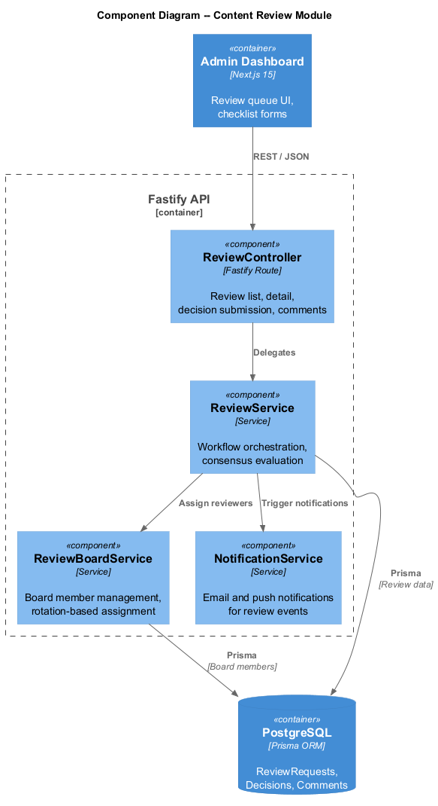
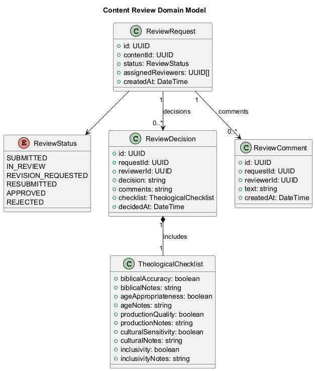
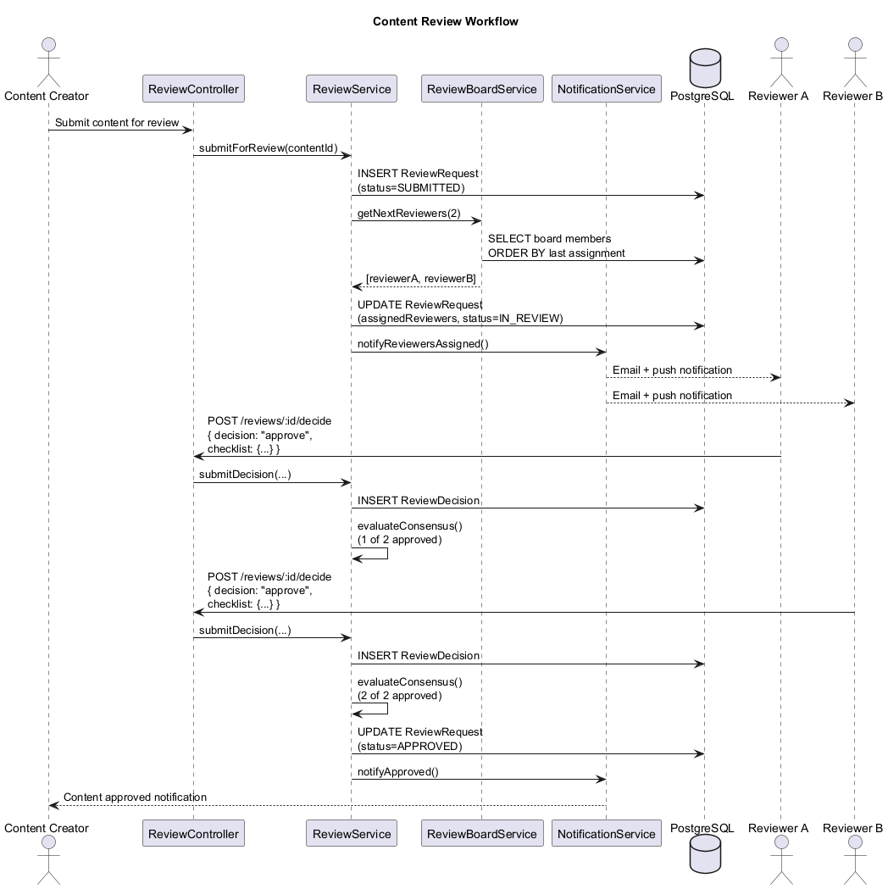
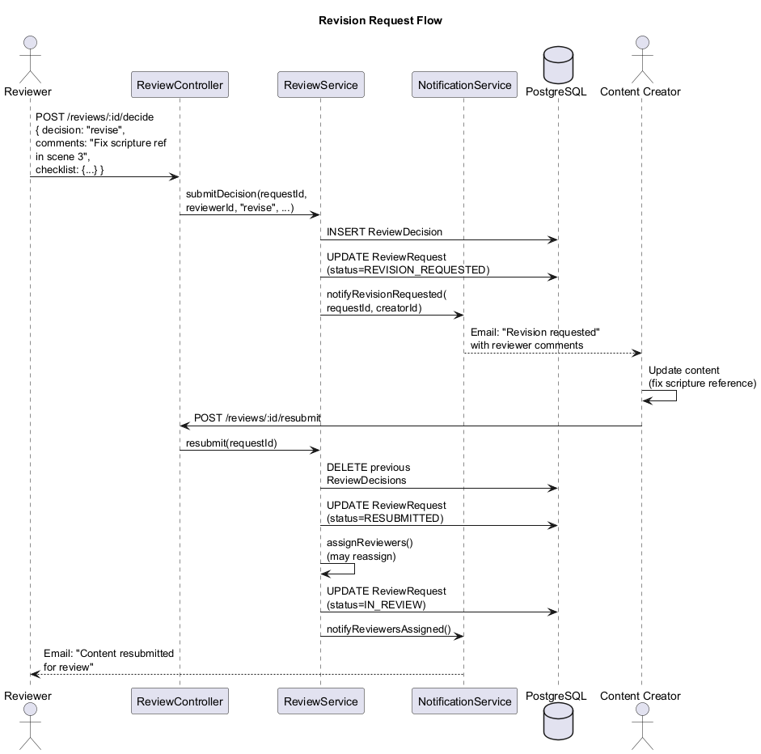
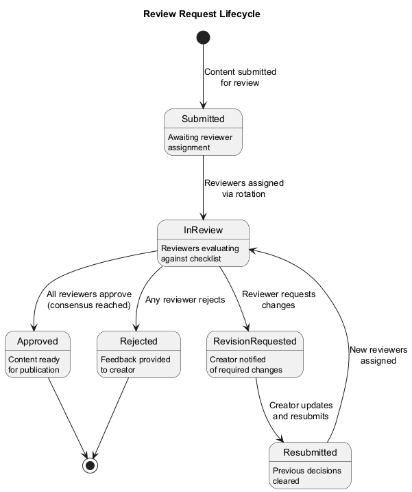

# Content Review -- Detailed Design

## 1. Overview

The Content Review module implements a multi-reviewer approval workflow to ensure every piece of content meets LightHouse's theological, developmental, and quality standards before publication. A **Content Review Board** of 5 members evaluates submissions against a structured **Theological Checklist**, and consensus is required before content reaches children.

### Review Board Composition

| Seat | Role                  | Responsibility                                    |
|------|-----------------------|---------------------------------------------------|
| 1    | Theology Reviewer     | Biblical accuracy, doctrinal soundness             |
| 2    | Theology Reviewer     | Scripture interpretation, theological balance      |
| 3    | Child Dev Specialist  | Age-appropriateness, developmental suitability     |
| 4    | Parent Representative | Family values alignment, practical concerns        |
| 5    | Media Specialist      | Production quality, engagement, accessibility      |

Key capabilities:

- Automated reviewer assignment with rotation for fair workload distribution.
- Structured theological checklist evaluation per reviewer.
- Consensus-based approval (minimum 2 reviewers must approve; no rejections).
- Revision request loop with creator notifications.
- Comment threads for reviewer discussion.
- Email and push notifications for review lifecycle events.

---

## 2. Architecture Diagrams

### 2.1 API Components (C4 Level 3)

---

## 3. Domain Model

### 3.1 Class Diagram

### 3.2 Entities

#### ReviewRequest

| Field             | Type           | Description                          |
|-------------------|----------------|--------------------------------------|
| id                | UUID           | Primary key                          |
| contentId         | UUID           | FK to Content                        |
| status            | ReviewStatus   | Current review status                |
| assignedReviewers | UUID[]         | Board member IDs assigned            |
| createdAt         | DateTime       | Submission timestamp                 |

#### ReviewDecision

| Field      | Type                  | Description                          |
|------------|-----------------------|--------------------------------------|
| id         | UUID                  | Primary key                          |
| requestId  | UUID                  | FK to ReviewRequest                  |
| reviewerId | UUID                  | FK to board member Account           |
| decision   | string                | "approve", "reject", "revise"        |
| comments   | string                | Free-form reviewer feedback          |
| checklist  | TheologicalChecklist  | Structured evaluation                |
| decidedAt  | DateTime              | Decision timestamp                   |

#### ReviewComment

| Field      | Type     | Description                          |
|------------|----------|--------------------------------------|
| id         | UUID     | Primary key                          |
| requestId  | UUID     | FK to ReviewRequest                  |
| reviewerId | UUID     | FK to Account                        |
| text       | string   | Comment body                         |
| createdAt  | DateTime | Comment timestamp                    |

#### TheologicalChecklist

| Field               | Type    | Description                                |
|---------------------|---------|--------------------------------------------|
| biblicalAccuracy    | boolean | Content aligns with scripture              |
| biblicalNotes       | string  | Reviewer notes on biblical accuracy        |
| ageAppropriateness  | boolean | Suitable for target age band               |
| ageNotes            | string  | Reviewer notes on age appropriateness      |
| productionQuality   | boolean | Audio/visual quality meets standards       |
| productionNotes     | string  | Reviewer notes on production quality       |
| culturalSensitivity | boolean | Respectful of diverse backgrounds          |
| culturalNotes       | string  | Reviewer notes on cultural sensitivity     |
| inclusivity         | boolean | Welcoming to all children                  |
| inclusivityNotes    | string  | Reviewer notes on inclusivity              |

### 3.3 Enums

#### ReviewStatus

| Value              | Description                                     |
|--------------------|-------------------------------------------------|
| SUBMITTED          | Content submitted for review                    |
| IN_REVIEW          | Reviewers actively evaluating                   |
| REVISION_REQUESTED | One or more reviewers requested changes          |
| RESUBMITTED        | Creator resubmitted after revision              |
| APPROVED           | Consensus reached; content approved             |
| REJECTED           | Content rejected by review board                |

---

## 4. Components

### 4.1 ReviewController

| Endpoint                              | Method | Description                          |
|---------------------------------------|--------|--------------------------------------|
| `/reviews`                            | GET    | List review requests (filterable)    |
| `/reviews/:id`                        | GET    | Review request detail                |
| `/reviews/:id/decide`                 | POST   | Submit decision + checklist          |
| `/reviews/:id/comments`              | GET    | List comments on a review            |
| `/reviews/:id/comments`              | POST   | Add a comment                        |

### 4.2 ReviewService

- `submitForReview(contentId)` -- creates a ReviewRequest and triggers reviewer assignment.
- `assignReviewers(requestId)` -- selects 2-3 board members via rotation algorithm.
- `submitDecision(requestId, reviewerId, decision, checklist)` -- records a decision; evaluates consensus.
- `evaluateConsensus(requestId)` -- checks if enough approvals exist with no rejections.
- `requestRevision(requestId, reviewerId, comments)` -- transitions status and notifies creator.
- `resubmit(requestId)` -- resets review after creator makes revisions.

### 4.3 ReviewBoardService

- `addBoardMember(accountId, role)` -- adds a member to the review board.
- `removeBoardMember(accountId)` -- deactivates a board member.
- `listBoardMembers()` -- returns active board members with their roles.
- `getNextReviewers(count, excludeIds)` -- rotation-based assignment; balances workload across members.

Assignment algorithm: round-robin by least-recent-assignment, ensuring at least one theology reviewer is always included.

### 4.4 NotificationService

- `notifyReviewersAssigned(requestId, reviewerIds)` -- email + push to assigned reviewers.
- `notifyDecisionSubmitted(requestId, decision)` -- notifies other reviewers and admin.
- `notifyRevisionRequested(requestId, contentCreatorId)` -- alerts creator to make changes.
- `notifyApproved(requestId, contentCreatorId)` -- informs creator content is approved.
- `notifyRejected(requestId, contentCreatorId, reason)` -- informs creator with rejection reason.

---

## 5. Sequence Diagrams

### 5.1 Review Workflow

### 5.2 Revision Request

---

## 6. State Diagram

### 6.1 Review Lifecycle

---

## 7. Consensus Rules

1. **Minimum reviewers**: At least 2 reviewers must submit decisions.
2. **Approval threshold**: All submitted decisions must be "approve" for consensus.
3. **Rejection threshold**: Any single "reject" decision triggers REJECTED status.
4. **Revision request**: Any "revise" decision pauses the review and notifies the creator.
5. **Theology gate**: At least one theology reviewer must approve for the content to pass.
6. **Resubmission**: On resubmission, previous decisions are cleared and new reviewers may be assigned.

---

## 8. Theological Checklist Details

### Biblical Accuracy
- Scripture references are correct and in context.
- Theological claims align with broadly accepted Christian doctrine.
- No misleading paraphrases or out-of-context quotations.

### Age Appropriateness
- Language complexity matches the target age band.
- Themes are suitable (no graphic violence, fear-inducing content).
- Concepts are presented at a developmentally appropriate level.

### Production Quality
- Audio is clear, well-mixed, and free of artifacts.
- Video resolution meets minimum standards (720p).
- Visual design is engaging and child-friendly.

### Cultural Sensitivity
- Content does not stereotype or marginalize any group.
- Representations of biblical figures are respectful and diverse.
- Language is inclusive and avoids culturally insensitive idioms.

### Inclusivity
- Content welcomes children of all backgrounds.
- Characters and stories reflect diversity.
- No denominational bias that would exclude families.

---

## 9. Public Content Standards

A summarized, parent-facing version of the review criteria is published at `/content-standards` on the LightHouse website. It explains:

- What the Content Review Board is and who sits on it.
- The five checklist criteria in plain language.
- How parents can flag content for re-review.
- The commitment to safe, theologically sound media.
