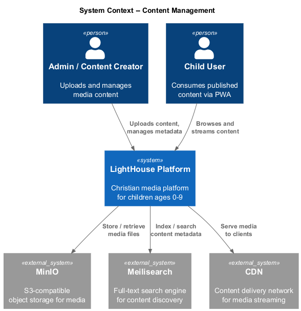
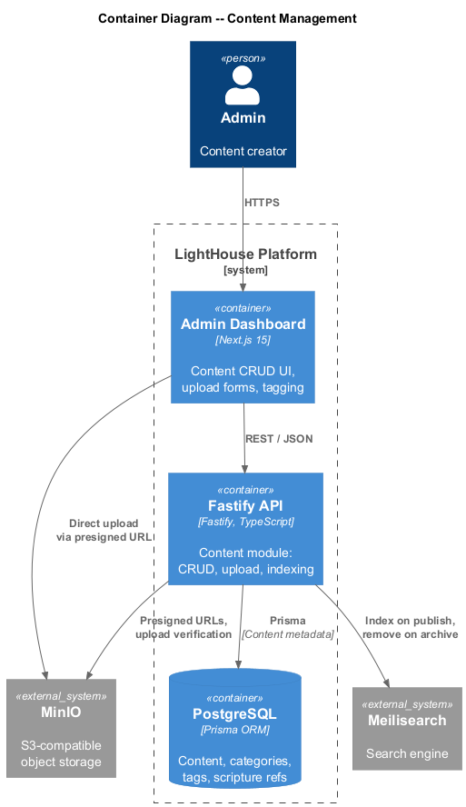
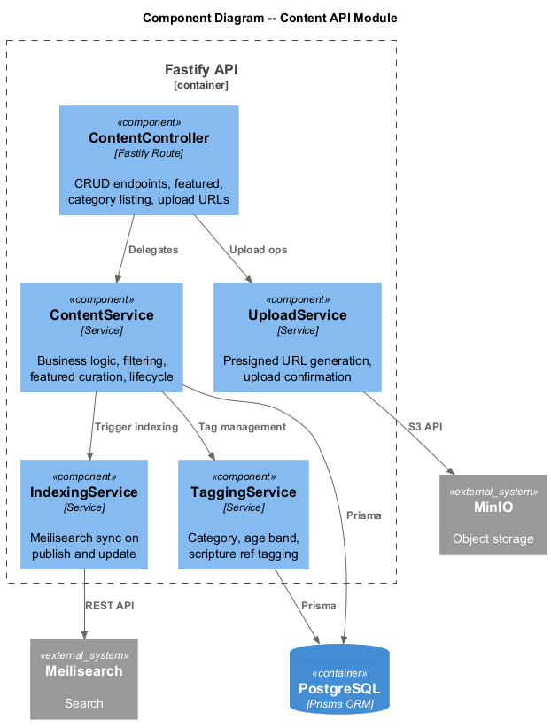
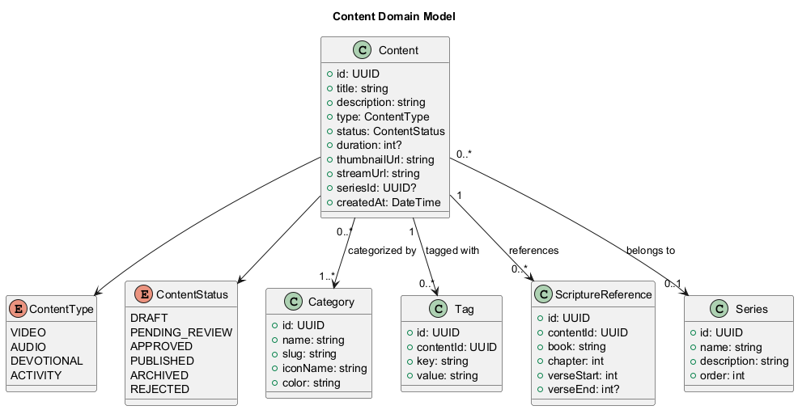
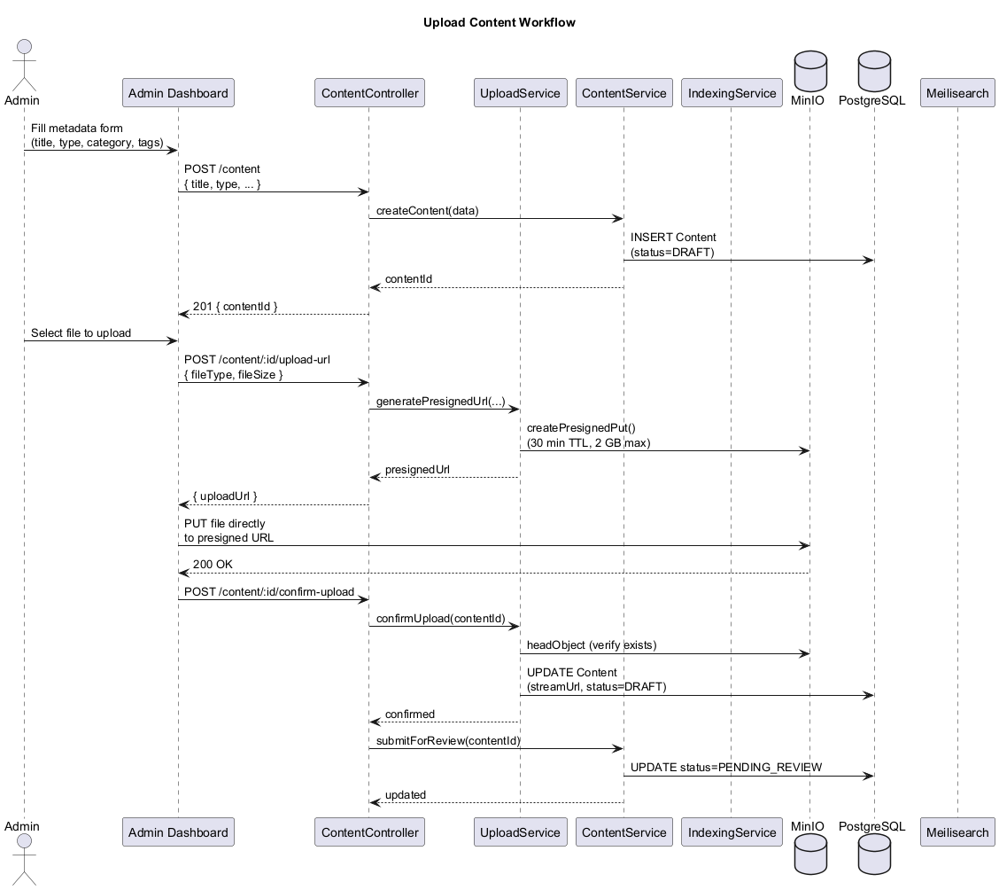
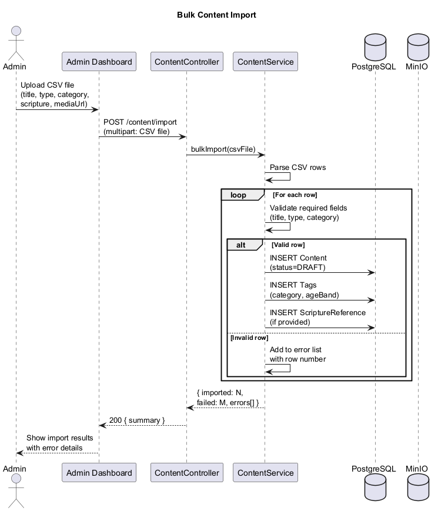
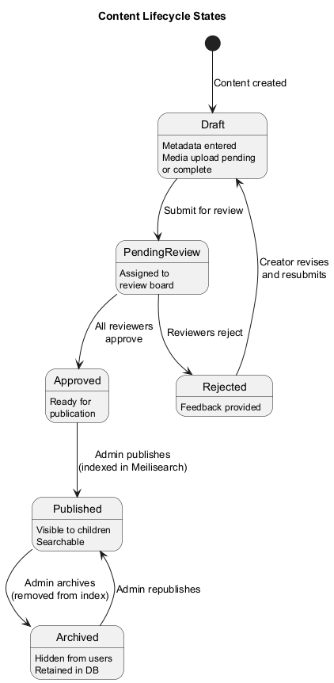

# Content Management -- Detailed Design

## 1. Overview

The Content module is the core data layer of the LightHouse Kids platform. It manages the full lifecycle of media content -- **videos**, **audio**, **devotionals**, and **activities** -- from upload through review to publication. Content is stored in **MinIO** (S3-compatible object storage), metadata in **PostgreSQL**, and search indices in **Meilisearch**.

Key capabilities:

- Multi-type content model (video, audio, devotional, activity).
- Presigned-URL upload workflow via MinIO for large files.
- Rich tagging taxonomy: categories, age bands, scripture references.
- Series grouping for multi-part content.
- Full-text search indexing via Meilisearch on publish/update.
- Admin dashboard CRUD with content lifecycle management.

---

## 2. Architecture Diagrams

### 2.1 System Context (C4 Level 1)



### 2.2 Container Diagram (C4 Level 2)



### 2.3 API Components (C4 Level 3)



---

## 3. Domain Model

### 3.1 Class Diagram



### 3.2 Entities

#### Content

| Field        | Type          | Description                              |
|--------------|---------------|------------------------------------------|
| id           | UUID          | Primary key                              |
| title        | string        | Content title (max 120 chars)            |
| description  | string        | Description / summary                    |
| type         | ContentType   | VIDEO, AUDIO, DEVOTIONAL, ACTIVITY       |
| status       | ContentStatus | Lifecycle status                         |
| duration     | int?          | Duration in seconds (video/audio)        |
| thumbnailUrl | string        | MinIO URL to thumbnail image             |
| streamUrl    | string        | MinIO URL to media file                  |
| seriesId     | UUID?         | FK to Series (nullable)                  |
| createdAt    | DateTime      | Creation timestamp                       |

#### Category

| Field    | Type   | Description                          |
|----------|--------|--------------------------------------|
| id       | UUID   | Primary key                          |
| name     | string | Display name                         |
| slug     | string | URL-safe identifier                  |
| iconName | string | Icon identifier for frontend         |
| color    | string | Hex color for UI theming             |

Default categories: Bible Stories, Worship Songs, Prayers, Devotionals, Activities.

#### Tag

| Field     | Type   | Description                          |
|-----------|--------|--------------------------------------|
| id        | UUID   | Primary key                          |
| contentId | UUID   | FK to Content                        |
| key       | string | Tag type (e.g., "ageBand", "theme")  |
| value     | string | Tag value (e.g., "SPROUTS", "faith") |

#### ScriptureReference

| Field      | Type   | Description                          |
|------------|--------|--------------------------------------|
| id         | UUID   | Primary key                          |
| contentId  | UUID   | FK to Content                        |
| book       | string | Bible book name                      |
| chapter    | int    | Chapter number                       |
| verseStart | int    | Starting verse                       |
| verseEnd   | int?   | Ending verse (nullable for single)   |

#### Series

| Field       | Type   | Description                          |
|-------------|--------|--------------------------------------|
| id          | UUID   | Primary key                          |
| name        | string | Series name                          |
| description | string | Series description                   |
| order       | int    | Sort order for display               |

### 3.3 Enums

#### ContentType

`VIDEO` | `AUDIO` | `DEVOTIONAL` | `ACTIVITY`

#### ContentStatus

`DRAFT` | `PENDING_REVIEW` | `APPROVED` | `PUBLISHED` | `ARCHIVED` | `REJECTED`

---

## 4. Components

### 4.1 ContentController

| Endpoint                        | Method | Description                          |
|---------------------------------|--------|--------------------------------------|
| `/content`                      | GET    | List content (filterable)            |
| `/content`                      | POST   | Create content metadata              |
| `/content/:id`                  | GET    | Get content detail                   |
| `/content/:id`                  | PUT    | Update content metadata              |
| `/content/:id`                  | DELETE | Archive content                      |
| `/content/:id/publish`          | POST   | Publish approved content             |
| `/content/featured`             | GET    | List featured content                |
| `/content/categories`           | GET    | List all categories                  |
| `/content/:id/upload-url`       | POST   | Get presigned upload URL             |
| `/content/:id/confirm-upload`   | POST   | Confirm upload completion            |

### 4.2 ContentService

- `createContent(data)` -- creates content record in DRAFT status.
- `updateContent(id, data)` -- updates metadata; only allowed in DRAFT or REVISION_REQUESTED status.
- `publishContent(id)` -- transitions APPROVED content to PUBLISHED; triggers indexing.
- `archiveContent(id)` -- soft-deletes; removes from search index.
- `listFeatured(ageBand)` -- returns editorially curated featured content filtered by age band.
- `filterContent(criteria)` -- filters by type, category, ageBand, series, scripture reference.

### 4.3 TaggingService

- `assignCategory(contentId, categoryId)` -- links content to a category.
- `assignAgeBands(contentId, ageBands[])` -- tags content for one or more age bands.
- `assignScriptureRef(contentId, reference)` -- attaches a scripture reference.
- `bulkTag(contentId, tags[])` -- assigns multiple tags at once.

### 4.4 UploadService

- `generatePresignedUrl(contentId, fileType, fileSize)` -- returns a MinIO presigned PUT URL (valid 30 min, max 2 GB).
- `confirmUpload(contentId)` -- verifies the file exists in MinIO, updates content record with final URL.
- `generateThumbnailUrl(contentId)` -- returns presigned URL for thumbnail upload.

### 4.5 IndexingService

- `indexContent(content)` -- upserts a Meilisearch document with searchable fields (title, description, category, tags, scripture).
- `removeFromIndex(contentId)` -- deletes the document from the search index.
- `reindexAll()` -- full re-index for maintenance or schema changes.
- `search(query, filters)` -- proxies filtered search to Meilisearch.

---

## 5. Sequence Diagrams

### 5.1 Upload Content



### 5.2 Bulk Import



---

## 6. State Diagram

### 6.1 Content Lifecycle



---

## 7. Tagging Taxonomy

### Categories (seeded)

| Category       | Slug              | Icon      | Color     |
|----------------|-------------------|-----------|-----------|
| Bible Stories   | `bible-stories`   | `book`    | `#4A90D9` |
| Worship Songs   | `worship-songs`   | `music`   | `#E8A838` |
| Prayers         | `prayers`         | `hands`   | `#7B68EE` |
| Devotionals     | `devotionals`     | `heart`   | `#E75480` |
| Activities      | `activities`      | `puzzle`  | `#3CB371` |

### Tag Keys

| Key            | Example Values                              |
|----------------|---------------------------------------------|
| `ageBand`      | SEEDLINGS, SPROUTS, EXPLORERS               |
| `theme`        | faith, love, kindness, courage, forgiveness  |
| `holiday`      | christmas, easter, thanksgiving              |
| `language`     | en, es, fr                                   |

---

## 8. MinIO Storage Layout

```
lighthouse-media/
  content/
    {contentId}/
      original.{ext}       # Original uploaded file
      thumbnail.{ext}      # Thumbnail image
      stream/              # Transcoded variants (future)
  imports/
    {importId}/
      source.csv           # Bulk import source file
```

---

## 9. Meilisearch Index Schema

```json
{
  "uid": "content",
  "primaryKey": "id",
  "searchableAttributes": ["title", "description", "categoryName", "tags", "scriptureText"],
  "filterableAttributes": ["type", "status", "categorySlug", "ageBands", "seriesId"],
  "sortableAttributes": ["createdAt", "title"],
  "rankingRules": ["words", "typo", "proximity", "attribute", "sort", "exactness"]
}
```
