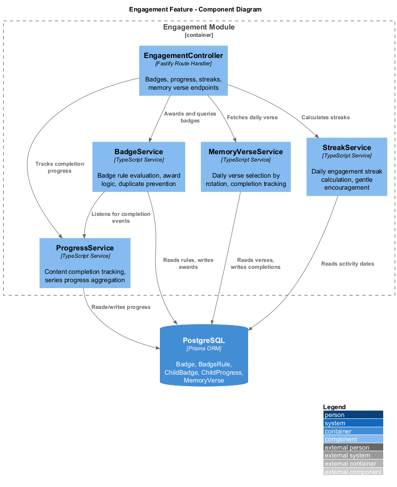
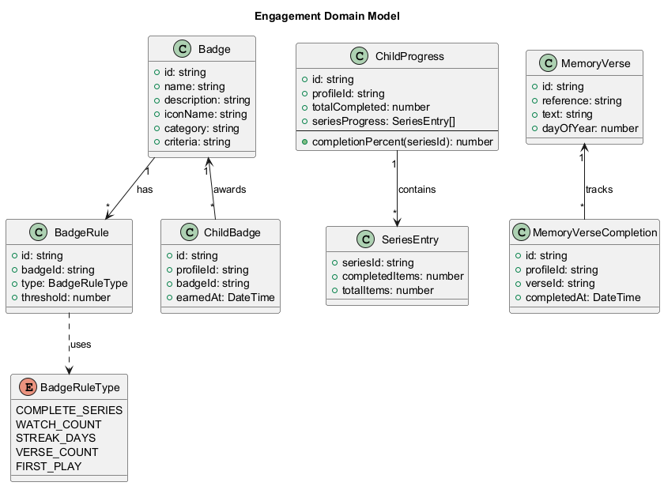
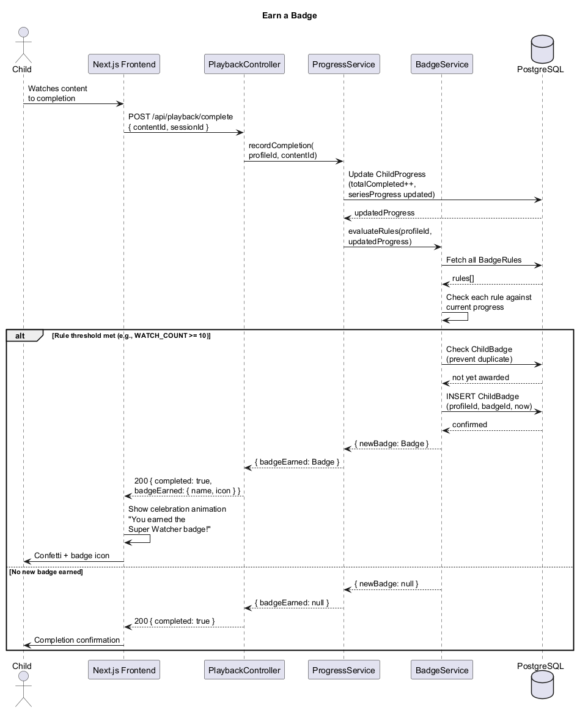
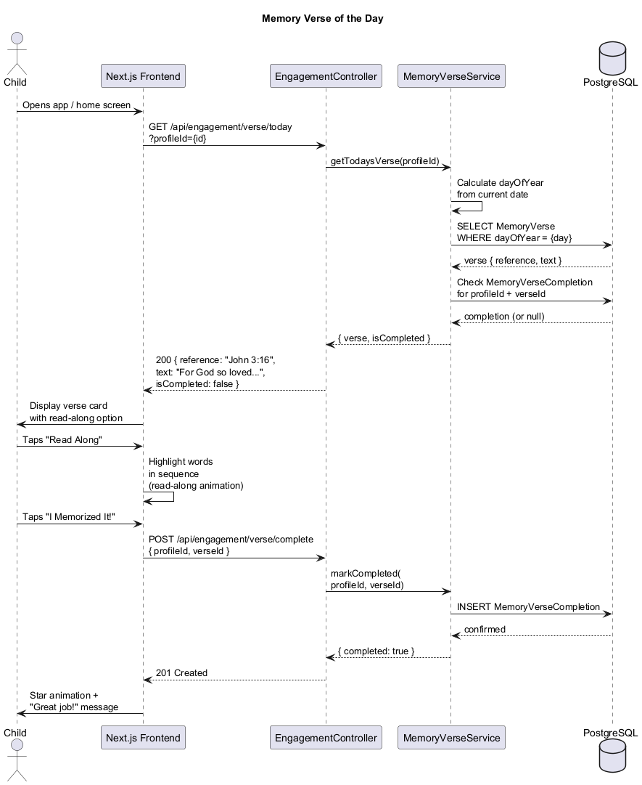
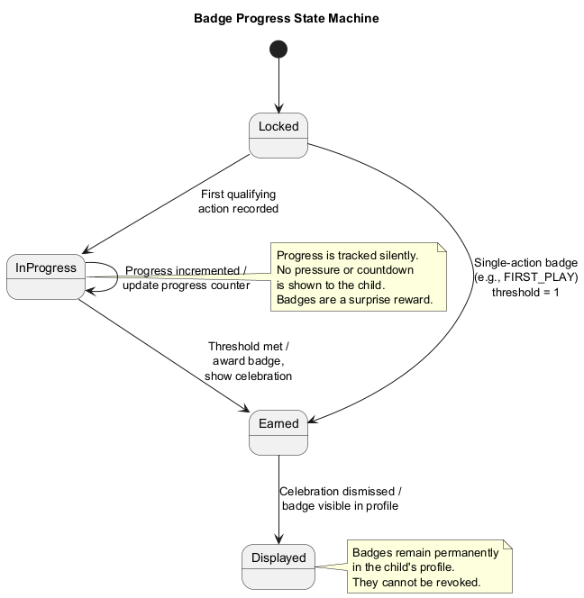

# Engagement Feature — Detailed Design

## Overview

The Engagement feature provides gentle, encouraging interactions that celebrate a child's journey through LightHouse Kids content. This includes a badge/achievement system, content completion progress tracking, a memory verse of the day with read-along support, and streak tracking. All engagement mechanics are designed to be non-addictive — there are no social features, no chat, no child-generated content (per EN-04), and no FOMO-inducing pressure.

### Key Principles

- **Non-addictive.** Badges are surprise rewards, not visible goals to chase. No countdown timers, no "you're falling behind" messaging.
- **Encouraging, not pressuring.** Streaks are tracked gently. Missing a day produces no negative feedback — the child simply sees "Welcome back!" instead.
- **No social features.** No leaderboards, no sharing, no chat, no child UGC. Progress is private to the child and visible to parents.
- **Faith-centered.** The memory verse feature is a core engagement mechanic, connecting daily app usage to scripture learning.

---

## Architecture

### Component Diagram

Shows the internal components of the Engagement module and their relationships.

---

## Domain Model

### Class Diagram

The core domain entities — `Badge`, `BadgeRule`, `ChildBadge`, `ChildProgress`, `MemoryVerse`, and `MemoryVerseCompletion`.

### Entity Descriptions

| Entity | Purpose |
|---|---|
| `Badge` | Defines an achievable badge with a name, description, icon, and category. |
| `BadgeRule` | Links a badge to its earning criteria — a rule type (e.g., WATCH_COUNT) and a threshold (e.g., 10). |
| `BadgeRuleType` | Enum of rule types: COMPLETE_SERIES, WATCH_COUNT, STREAK_DAYS, VERSE_COUNT, FIRST_PLAY. |
| `ChildBadge` | Records that a specific child has earned a specific badge, with the timestamp. |
| `ChildProgress` | Tracks a child's overall completion count and per-series progress. |
| `SeriesEntry` | Nested object within ChildProgress tracking completion of items within a series. |
| `MemoryVerse` | A scripture verse assigned to a specific day of the year (1-366 rotation). |
| `MemoryVerseCompletion` | Records that a child has marked a specific verse as memorized. |

---

## Key Classes and Interfaces

### EngagementController (Fastify Route Handler)

Exposes REST endpoints for the frontend:

- `GET /api/engagement/badges/:profileId` — List all badges with earned/locked status for a child.
- `GET /api/engagement/progress/:profileId` — Get completion stats and series progress.
- `GET /api/engagement/streak/:profileId` — Get current streak length and last active date.
- `GET /api/engagement/verse/today?profileId=` — Get today's memory verse with completion status.
- `POST /api/engagement/verse/complete` — Mark today's verse as memorized.

### BadgeService

Evaluates badge rules when progress changes:

- **Rule evaluation:** When `ProgressService` records a completion, `BadgeService` checks all `BadgeRule` records against the child's current stats.
- **Duplicate prevention:** Before awarding, checks if the child already has the badge.
- **Award logic:** Creates a `ChildBadge` record and returns badge metadata for the celebration animation.
- **Rule types supported:**
  - `FIRST_PLAY` — Awarded on the child's very first content completion.
  - `WATCH_COUNT` — Awarded when total completed items reaches a threshold (e.g., 10, 25, 50).
  - `COMPLETE_SERIES` — Awarded when all items in a specific series are completed.
  - `STREAK_DAYS` — Awarded when the child's engagement streak reaches a threshold (e.g., 7, 30 days).
  - `VERSE_COUNT` — Awarded when the child has memorized a threshold of verses.

### ProgressService

Tracks content completion:

- **Completion recording:** Increments `totalCompleted` and updates `seriesProgress` when a child finishes a content item.
- **Series tracking:** Maintains a count of completed vs. total items per series, enabling "3 of 8 episodes watched" displays.
- **Event emission:** Notifies `BadgeService` after every completion for rule evaluation.

### MemoryVerseService

Manages the daily verse rotation:

- **Verse selection:** Uses `dayOfYear` (1-366) to select today's verse. The verse set rotates annually.
- **Completion tracking:** Records when a child marks a verse as memorized.
- **Read-along support:** The frontend renders word-by-word highlighting; the service provides the verse text and reference.

### StreakService

Calculates engagement streaks with a gentle approach:

- **Streak calculation:** Counts consecutive days with at least one content completion or verse memorization.
- **No FOMO:** If a child misses a day, the streak resets silently. The UI shows "Welcome back!" rather than "You lost your streak!"
- **Streak badges:** Integrates with `BadgeService` to award streak-based badges at milestones (7 days, 30 days).

---

## Sequence Diagrams

### Earn a Badge

A child completes content, triggering progress tracking and badge rule evaluation. If a threshold is met, the badge is awarded and a celebration animation plays.

### Memory Verse of the Day

The app loads today's verse based on the day of the year. The child can use the read-along feature and mark the verse as memorized.

---

## State Machine

### Badge Progress States

Badges transition from Locked through InProgress to Earned, then Displayed permanently on the child's profile.

| State | Description |
|---|---|
| Locked | The child has not yet started working toward this badge. The badge is not visible to the child. |
| InProgress | The child has made partial progress toward the badge criteria. Progress is tracked silently — no visible progress bar or pressure. |
| Earned | The threshold has been met. A celebration animation plays. The `ChildBadge` record is created. |
| Displayed | The celebration has been dismissed. The badge is permanently visible in the child's profile. |

---

## Badge Categories

Badges are organized into categories for display in the child's profile:

| Category | Examples |
|---|---|
| Explorer | First Play, 10 Videos Watched, 50 Videos Watched |
| Story Lover | Complete a Series, Complete 3 Series |
| Scripture Star | 5 Verses Memorized, 25 Verses Memorized |
| Faithful Friend | 7-Day Streak, 30-Day Streak |

---

## Design Safeguards (Non-Addictive)

| Concern | Safeguard |
|---|---|
| FOMO pressure | Streaks reset silently. No "you lost your streak" messaging. |
| Goal obsession | Badge progress is not shown to children. Badges are surprise rewards. |
| Social comparison | No leaderboards, no sharing, no visibility into other children's progress. |
| Infinite scrolling | Content feeds are finite, curated playlists — not algorithmic infinite feeds. |
| External pressure | No push notifications about streaks or unfinished content. |
