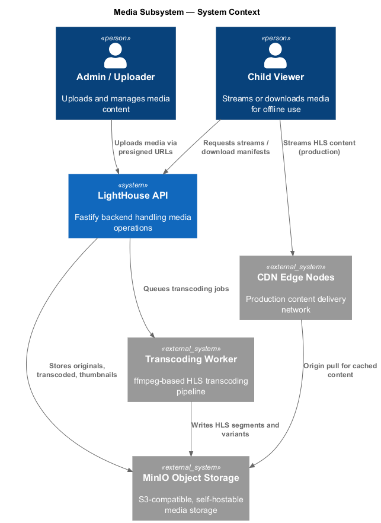
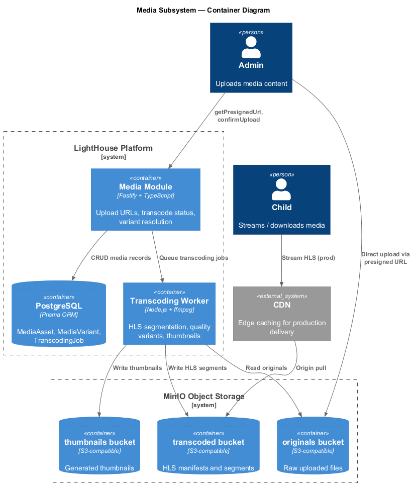
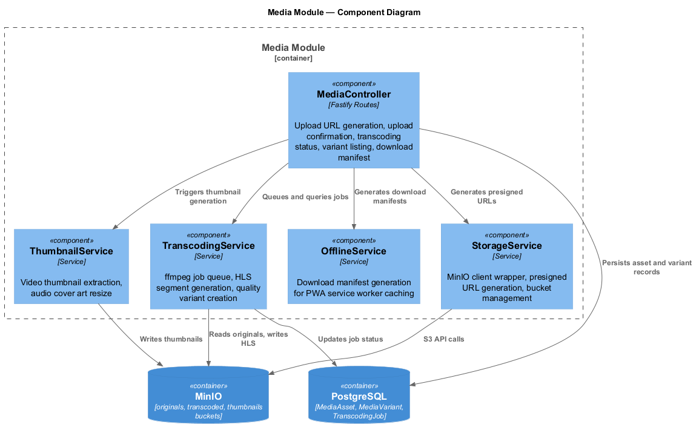
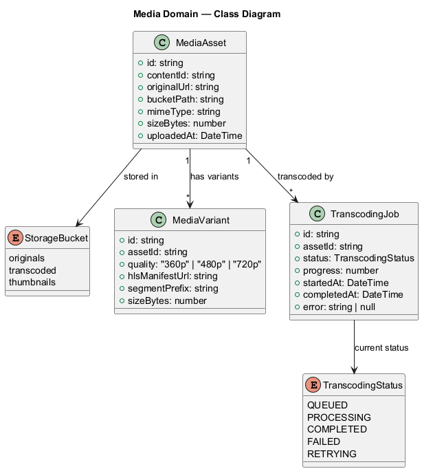
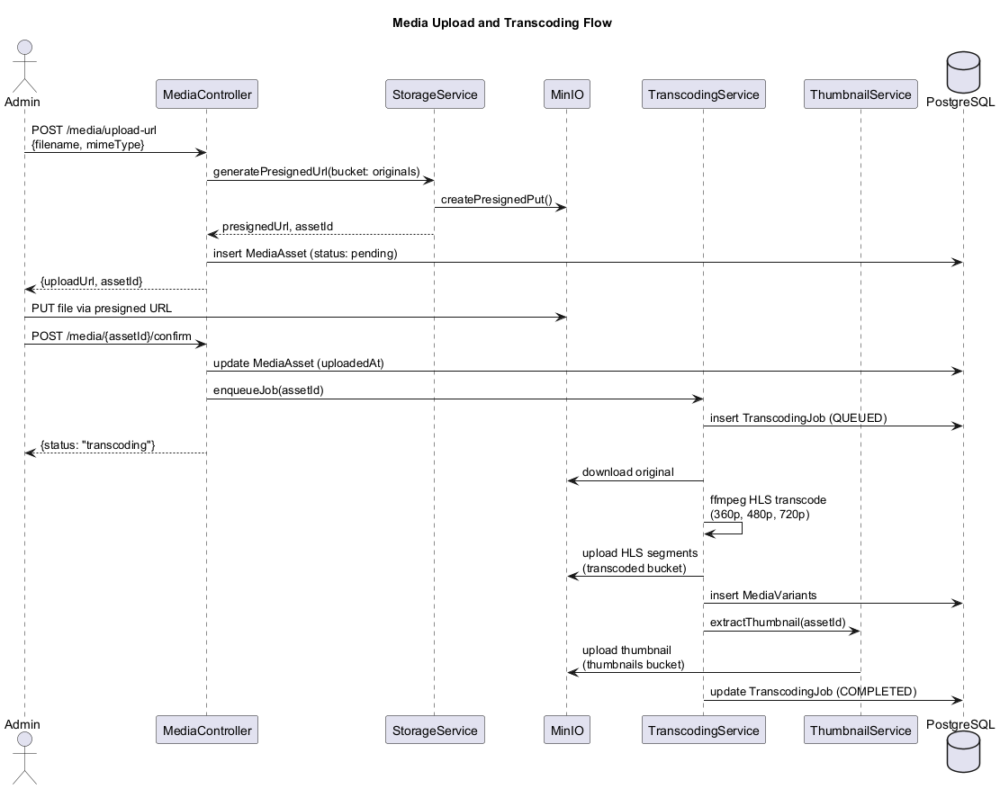
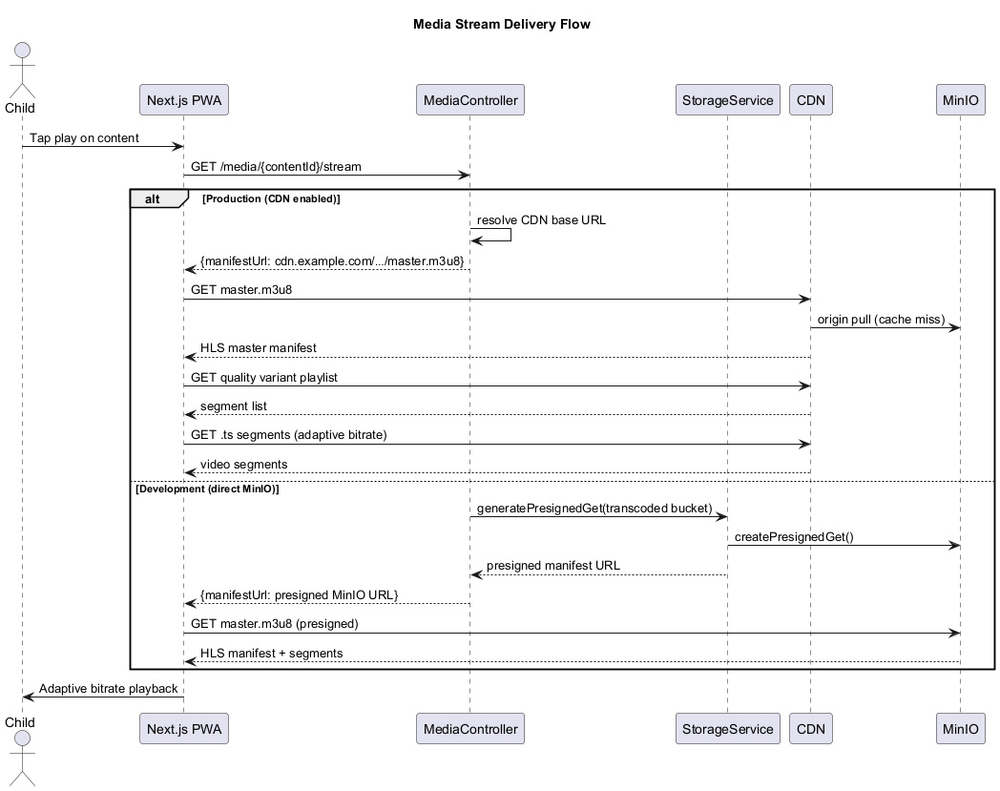
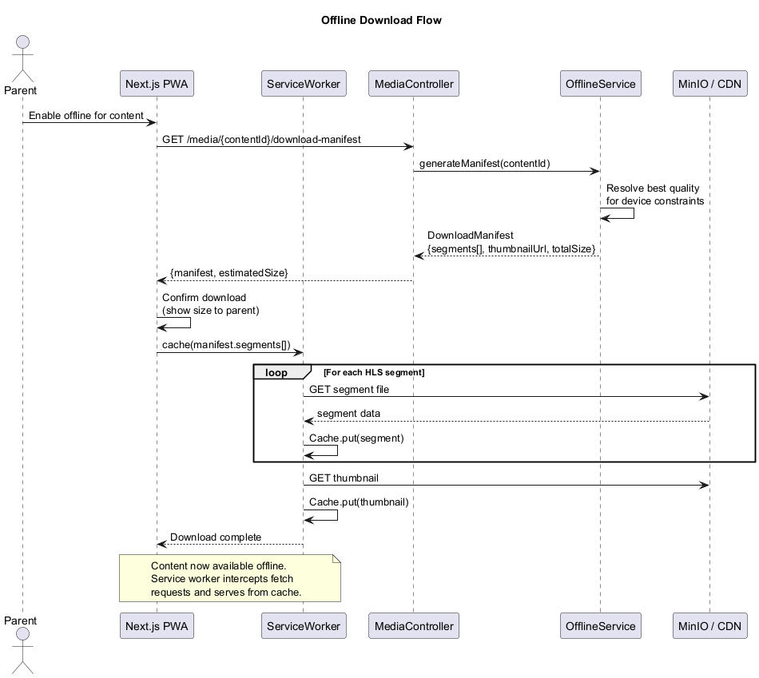
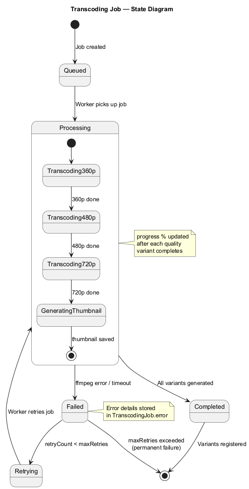

# Media Subsystem — Detailed Design

## Overview

The Media subsystem handles all aspects of media storage, processing, and delivery for LightHouse Kids. It is built around **MinIO** (S3-compatible, self-hostable object storage), an **ffmpeg-based HLS transcoding pipeline**, and **PWA offline download support**. In production, a CDN sits in front of MinIO for low-latency global delivery; in development, MinIO serves content directly via presigned URLs.

### Key Capabilities

- **Presigned URL uploads** — Admins upload media directly to MinIO without proxying through the API server, reducing bandwidth and latency on the backend.
- **HLS transcoding** — Uploaded originals are transcoded into adaptive-bitrate HLS streams at 360p, 480p, and 720p quality variants using ffmpeg.
- **Thumbnail generation** — Video frames are extracted automatically; audio content uses resized cover art.
- **CDN integration** — Production deployments route playback through CDN edge nodes with MinIO as the origin.
- **Offline downloads** — Parents can download content for offline use. The API generates a download manifest that the PWA service worker uses to cache HLS segments locally.
- **Bucket organization** — MinIO is organized into three buckets: `originals` (raw uploads), `transcoded` (HLS manifests and segments), and `thumbnails` (generated thumbnails and cover art).

---

## Architecture Diagrams

### System Context

Shows how admin uploaders, child viewers, and external systems interact with the media subsystem.



### Container Diagram

Details the internal containers: API media module, MinIO buckets, transcoding worker, CDN, and PostgreSQL.



### Component Diagram

Breaks down the media module into its internal components and their responsibilities.



---

## Domain Model

### Class Diagram



### Entities and Types

#### `MediaAsset`

Represents a single uploaded media file (video or audio).

| Field        | Type     | Description                              |
|-------------|----------|------------------------------------------|
| `id`        | `string` | Unique identifier (UUID)                 |
| `contentId` | `string` | FK to the parent Content record          |
| `originalUrl` | `string` | URL/path to the original uploaded file |
| `bucketPath` | `string` | Full path within the MinIO bucket       |
| `mimeType`  | `string` | MIME type (e.g., `video/mp4`)            |
| `sizeBytes` | `number` | File size in bytes                       |
| `uploadedAt` | `DateTime` | Timestamp of confirmed upload          |

#### `MediaVariant`

A transcoded quality variant of a media asset, represented as an HLS stream.

| Field            | Type     | Description                                |
|-----------------|----------|--------------------------------------------|
| `id`            | `string` | Unique identifier (UUID)                   |
| `assetId`       | `string` | FK to the parent MediaAsset                |
| `quality`       | `enum`   | `360p`, `480p`, or `720p`                  |
| `hlsManifestUrl` | `string` | URL to the HLS playlist for this variant  |
| `segmentPrefix` | `string` | Path prefix for HLS `.ts` segment files    |
| `sizeBytes`     | `number` | Total size of all segments for this variant |

#### `TranscodingJob`

Tracks the progress and status of an ffmpeg transcoding job.

| Field         | Type               | Description                          |
|--------------|---------------------|--------------------------------------|
| `id`         | `string`            | Unique identifier (UUID)             |
| `assetId`    | `string`            | FK to the MediaAsset being transcoded |
| `status`     | `TranscodingStatus` | Current job state                    |
| `progress`   | `number`            | Percentage complete (0-100)          |
| `startedAt`  | `DateTime`          | When processing began                |
| `completedAt` | `DateTime`         | When processing finished             |
| `error`      | `string | null`     | Error message if failed              |

#### `TranscodingStatus` (enum)

```
QUEUED → PROCESSING → COMPLETED
                   ↘ FAILED → RETRYING → PROCESSING
                              FAILED (max retries)
```

Values: `QUEUED`, `PROCESSING`, `COMPLETED`, `FAILED`, `RETRYING`

#### `StorageBucket`

MinIO bucket identifiers: `originals`, `transcoded`, `thumbnails`.

---

## Service Layer

### `MediaController`

Fastify route handler exposing the media API surface.

| Endpoint                              | Method | Description                            |
|---------------------------------------|--------|----------------------------------------|
| `/media/upload-url`                   | POST   | Generate a presigned upload URL        |
| `/media/:assetId/confirm`             | POST   | Confirm upload and trigger transcoding |
| `/media/:assetId/status`              | GET    | Query transcoding job status           |
| `/media/:contentId/variants`          | GET    | List available quality variants        |
| `/media/:contentId/stream`            | GET    | Resolve streaming URL (CDN or MinIO)   |
| `/media/:contentId/download-manifest` | GET    | Generate offline download manifest     |

### `StorageService`

Wraps the MinIO client SDK. Responsibilities:

- Presigned URL generation (PUT for uploads, GET for downloads)
- Bucket existence checks and creation on startup
- Object deletion and listing
- Multipart upload support for large files

### `TranscodingService`

Manages the ffmpeg transcoding pipeline.

- Maintains a job queue (backed by PostgreSQL or an external queue like BullMQ)
- Spawns ffmpeg processes for each quality variant (360p, 480p, 720p)
- Generates HLS master manifests linking all variant playlists
- Updates `TranscodingJob` records with progress and status
- Implements retry logic with configurable `maxRetries`

### `ThumbnailService`

- Extracts a representative frame from video at a configurable timestamp
- Resizes audio cover art to standard thumbnail dimensions
- Writes thumbnails to the `thumbnails` bucket in WebP format

### `OfflineService`

- Builds a download manifest listing all HLS segment URLs for a given content item
- Selects the best quality variant based on device constraints (passed by the client)
- Includes thumbnail URL and total download size estimate
- The PWA service worker uses this manifest to pre-cache content

---

## Sequence Diagrams

### Upload and Transcoding

Full flow from admin upload through transcoding to variant registration.



### Stream Delivery

How content is streamed to children, with CDN in production and direct MinIO in development.



### Offline Download

Parent-initiated download flow using service worker caching.



---

## State Diagram

### Transcoding Job Lifecycle



The transcoding job progresses through quality variants sequentially (360p, 480p, 720p) followed by thumbnail generation. Progress percentage is updated after each variant completes. Failed jobs are retried up to a configurable maximum before being marked as permanently failed.

---

## Storage Bucket Organization

```
MinIO
├── originals/
│   └── {contentId}/{assetId}/original.{ext}
├── transcoded/
│   └── {contentId}/{assetId}/
│       ├── master.m3u8
│       ├── 360p/
│       │   ├── playlist.m3u8
│       │   └── segment-{n}.ts
│       ├── 480p/
│       │   ├── playlist.m3u8
│       │   └── segment-{n}.ts
│       └── 720p/
│           ├── playlist.m3u8
│           └── segment-{n}.ts
└── thumbnails/
    └── {contentId}/{assetId}/thumb.webp
```

## Configuration

| Setting                  | Default     | Description                                |
|--------------------------|-------------|--------------------------------------------|
| `MINIO_ENDPOINT`         | `localhost` | MinIO server hostname                      |
| `MINIO_PORT`             | `9000`      | MinIO server port                          |
| `MINIO_ACCESS_KEY`       | —           | MinIO access key                           |
| `MINIO_SECRET_KEY`       | —           | MinIO secret key                           |
| `CDN_BASE_URL`           | `null`      | CDN URL (null = direct MinIO)              |
| `TRANSCODE_MAX_RETRIES`  | `3`         | Max retry attempts for failed jobs         |
| `PRESIGNED_URL_EXPIRY`   | `3600`      | Presigned URL expiry in seconds            |
| `THUMBNAIL_TIMESTAMP`    | `5`         | Seconds into video for thumbnail capture   |
