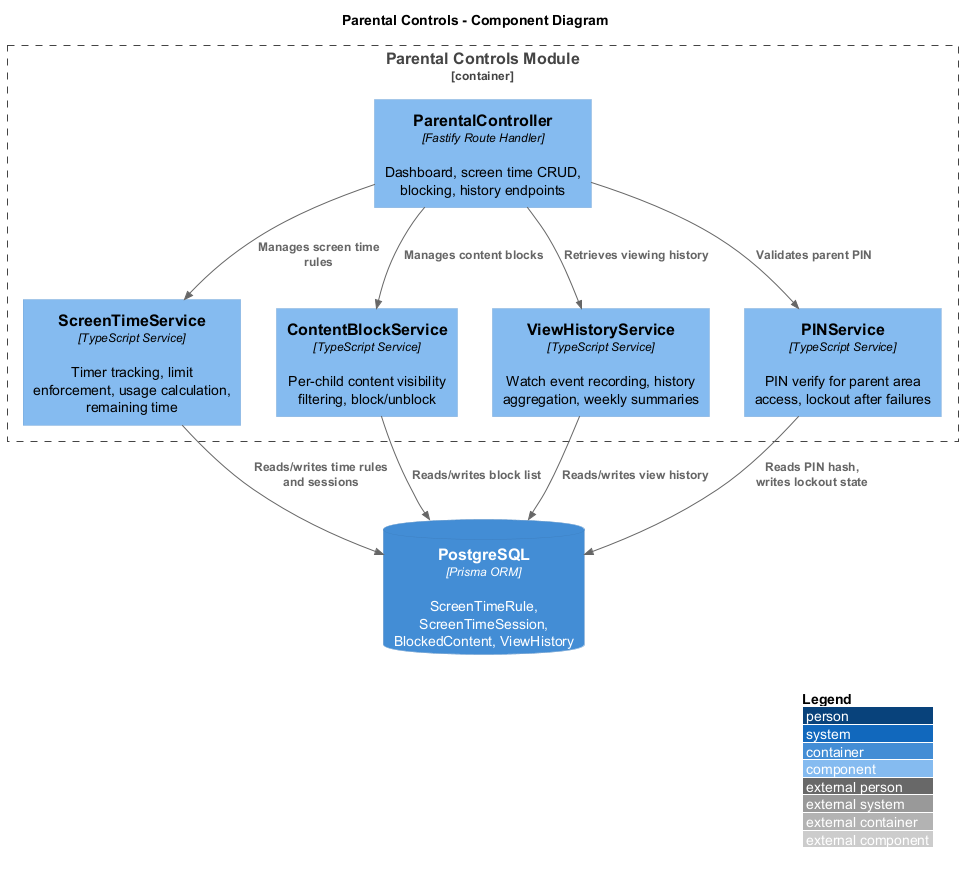
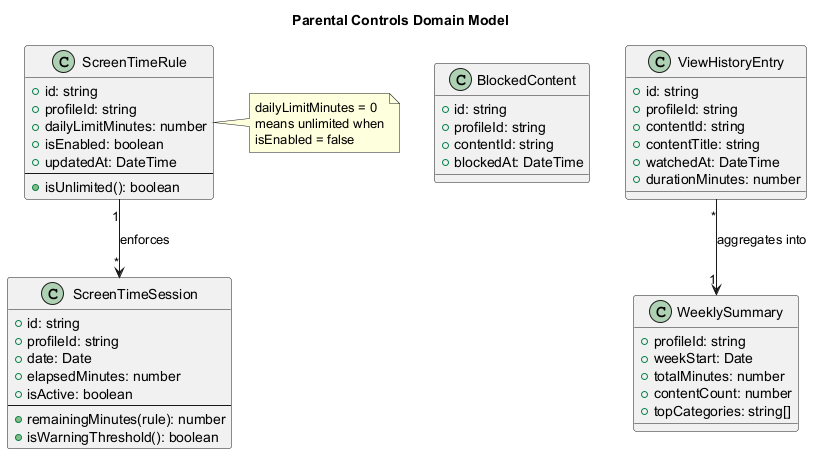
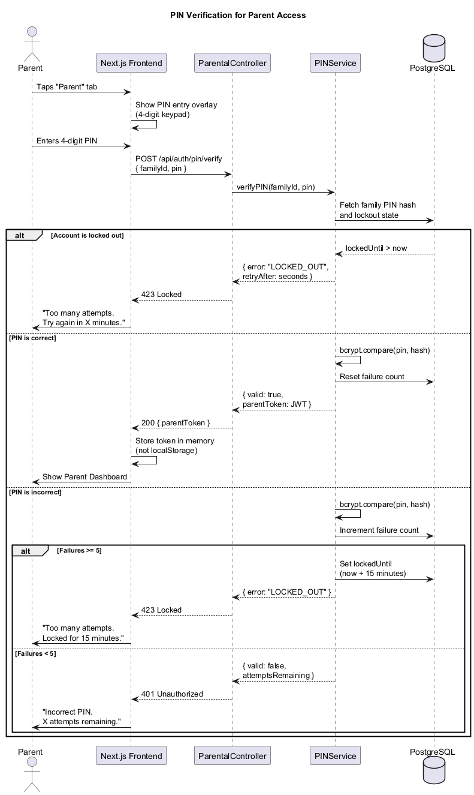
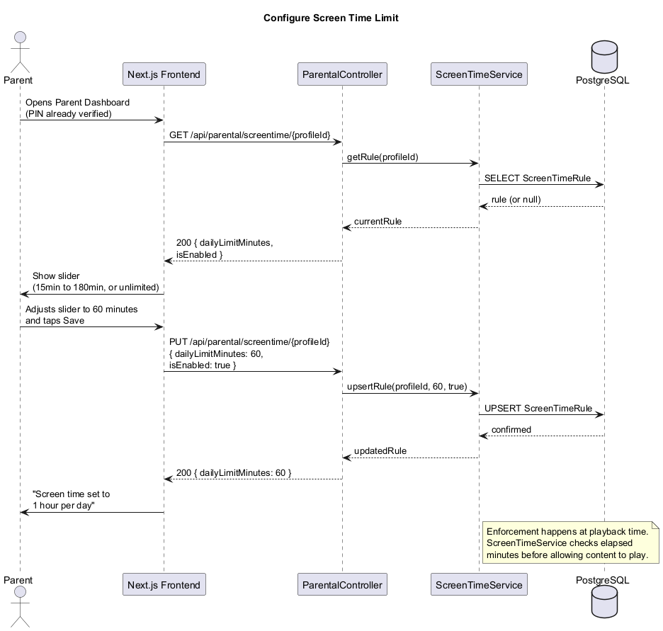
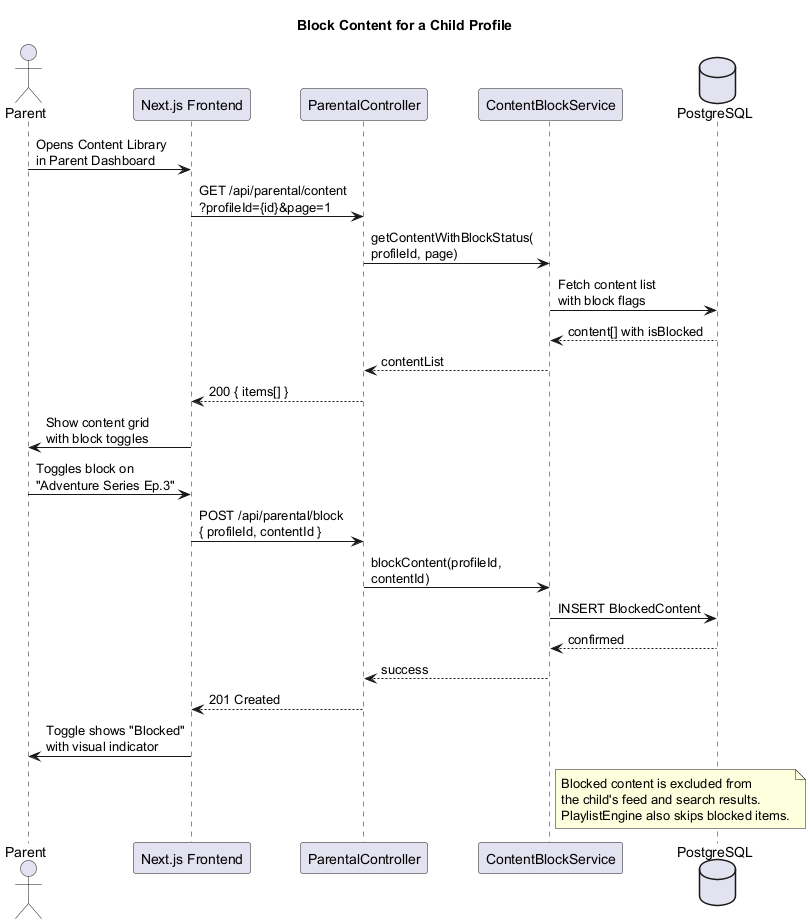
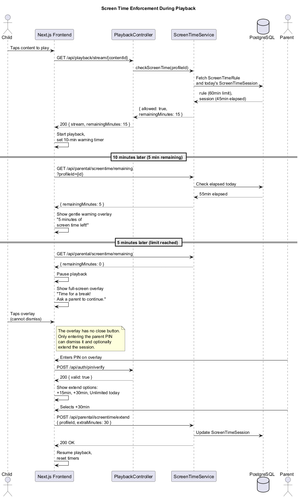
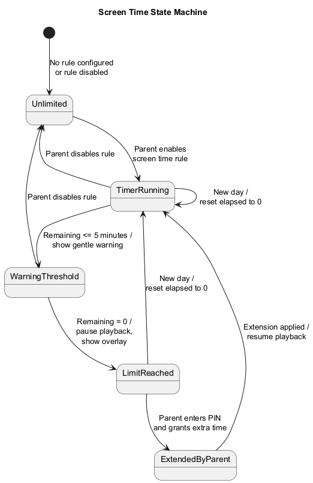

# Parental Controls Feature — Detailed Design

## Overview

Parental Controls give parents full authority over their children's experience on LightHouse Kids. The parent area is protected by a 4-digit PIN (bcrypt hashed, with lockout after repeated failures). Parents can set daily screen time limits per child, block specific content items, and review aggregated viewing history. Screen time enforcement uses a friendly overlay that only a parent can dismiss — children cannot bypass or close it.

### Key Principles

- **Parent-first.** Parents have complete control. Children cannot access or modify any parental settings.
- **PIN-protected.** The parent area requires a 4-digit PIN verified against a bcrypt hash. After 5 failed attempts, the account is locked for 15 minutes.
- **No child dismissal.** The screen time overlay has no close button. Only a valid parent PIN can dismiss it.
- **Privacy-respecting.** Viewing history is stored per-family and never leaves the family's account. No data is shared externally.

---

## Architecture

### Component Diagram

Shows the internal components of the Parental Controls module and their relationship to PostgreSQL.

---

## Domain Model

### Class Diagram

The core domain entities — `ScreenTimeRule`, `ScreenTimeSession`, `BlockedContent`, `ViewHistoryEntry`, and `WeeklySummary`.

### Entity Descriptions

| Entity | Purpose |
|---|---|
| `ScreenTimeRule` | Defines the daily screen time limit for a child profile. Can be enabled/disabled. |
| `ScreenTimeSession` | Tracks elapsed screen time for a specific child on a specific date. One record per child per day. |
| `BlockedContent` | Records a content item that a parent has blocked for a specific child profile. |
| `ViewHistoryEntry` | A single viewing event — records what was watched, when, and for how long. |
| `WeeklySummary` | Aggregated view of a child's activity over a week. Computed from ViewHistoryEntry records. |

---

## Key Classes and Interfaces

### ParentalController (Fastify Route Handler)

All endpoints require a valid parent token (obtained via PIN verification):

- `GET /api/parental/screentime/:profileId` — Get current screen time rule for a child.
- `PUT /api/parental/screentime/:profileId` — Create or update a screen time rule.
- `GET /api/parental/screentime/remaining?profileId=` — Check remaining screen time (used by frontend timers).
- `POST /api/parental/screentime/extend` — Extend today's session by a specified number of minutes.
- `POST /api/parental/block` — Block a content item for a child.
- `DELETE /api/parental/block` — Unblock a content item for a child.
- `GET /api/parental/content?profileId=` — List content with per-child block status.
- `GET /api/parental/history/:profileId` — Get viewing history with pagination.
- `GET /api/parental/history/:profileId/summary` — Get weekly summary aggregation.

### ScreenTimeService

Manages screen time rules and enforcement:

- **Rule management:** CRUD operations on `ScreenTimeRule` records.
- **Usage calculation:** Queries `ScreenTimeSession` for today's elapsed minutes.
- **Enforcement check:** Called by `PlaybackController` before starting playback. Returns `{ allowed, remainingMinutes }`.
- **Extension:** Increases the effective limit for the current day by a parent-specified amount.
- **Daily reset:** Sessions are date-scoped — a new day automatically starts fresh.

### ContentBlockService

Manages per-child content visibility:

- **Block/unblock:** Inserts or deletes `BlockedContent` records.
- **Filtering:** Provides a filter predicate used by content feeds, search results, and the `PlaylistEngine` to exclude blocked content for a given child profile.

### ViewHistoryService

Records and aggregates viewing activity:

- **Recording:** Creates `ViewHistoryEntry` records when playback completes or when significant watch time occurs.
- **History retrieval:** Paginated list of what a child has watched, newest first.
- **Weekly summaries:** Aggregates entries into `WeeklySummary` objects showing total minutes, content count, and top categories.

### PINService

Shared with the auth module. Handles PIN verification:

- **Verification:** Compares a submitted PIN against the bcrypt hash stored for the family.
- **Lockout:** Tracks failed attempt count. After 5 consecutive failures, locks the account for 15 minutes.
- **Token issuance:** On successful verification, returns a short-lived JWT (parent token) that authorizes access to parental endpoints.

---

## Sequence Diagrams

### PIN Verification

A parent taps the Parent tab, enters their 4-digit PIN, and the API verifies it against the stored bcrypt hash. Includes lockout handling after 5 failed attempts.

### Configure Screen Time

A parent opens the dashboard, adjusts the daily limit slider, and saves. The rule is persisted and enforced on the child's next playback attempt.

### Block Content

A parent browses the content library from the dashboard, toggles a block on a specific item, and it is immediately hidden from the child's feed.

### Screen Time Enforcement

The full enforcement flow: playback starts with remaining time, a 5-minute warning appears, the limit is reached, a non-dismissable overlay is shown, and a parent enters the PIN to extend.

---

## State Machine

### Screen Time States

The screen time system transitions through well-defined states from unlimited through active timing to enforcement.

| State | Description |
|---|---|
| Unlimited | No rule is configured or the rule is disabled. No tracking occurs. |
| TimerRunning | Screen time is being tracked. Remaining time is decremented. |
| WarningThreshold | 5 minutes or less remain. A gentle warning overlay is shown. |
| LimitReached | Time is up. Playback is paused and a non-dismissable overlay appears. |
| ExtendedByParent | A parent has entered their PIN and granted additional time. Transitions back to TimerRunning. |

---

## Security Considerations

### PIN Storage

- PINs are hashed with **bcrypt** (cost factor 12) before storage. Raw PINs are never persisted.
- The PIN hash is stored on the `Family` entity, not on individual profiles.

### Lockout Policy

- After **5 consecutive failed attempts**, the account is locked for **15 minutes**.
- The lockout timestamp (`lockedUntil`) is stored in the database.
- Successful verification resets the failure counter.

### Parent Token

- On successful PIN verification, a **short-lived JWT** (15-minute expiry) is issued.
- The token is held in memory only — not in `localStorage` or cookies — to prevent child access.
- All parental endpoints validate this token before processing requests.

### Screen Time Overlay

- The enforcement overlay is rendered as a **full-screen, non-interactive layer** with no close button.
- The only interactive element is the PIN input field.
- The overlay cannot be dismissed by navigating, refreshing, or using browser back — the frontend checks remaining time on every route change.
