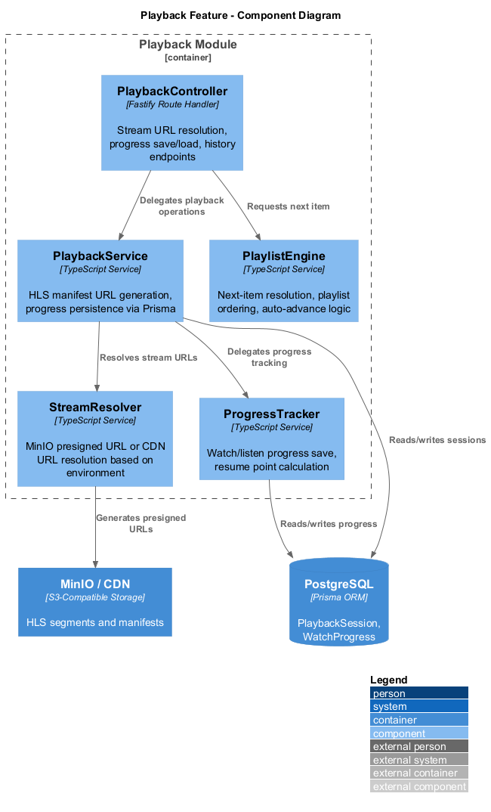
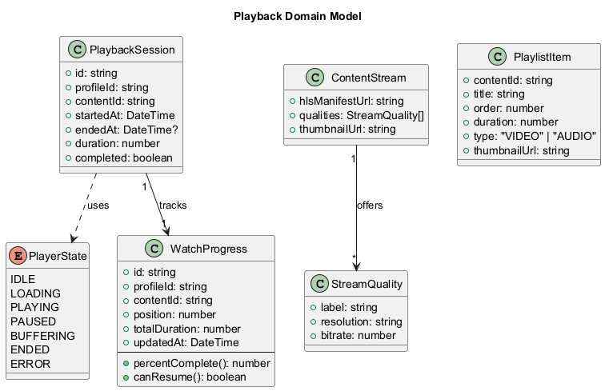
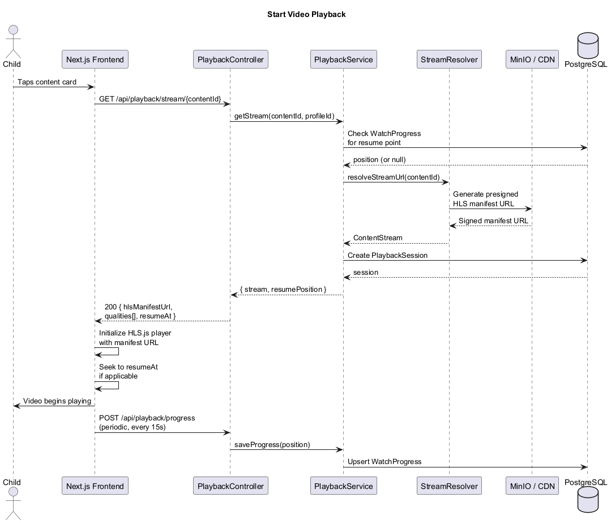
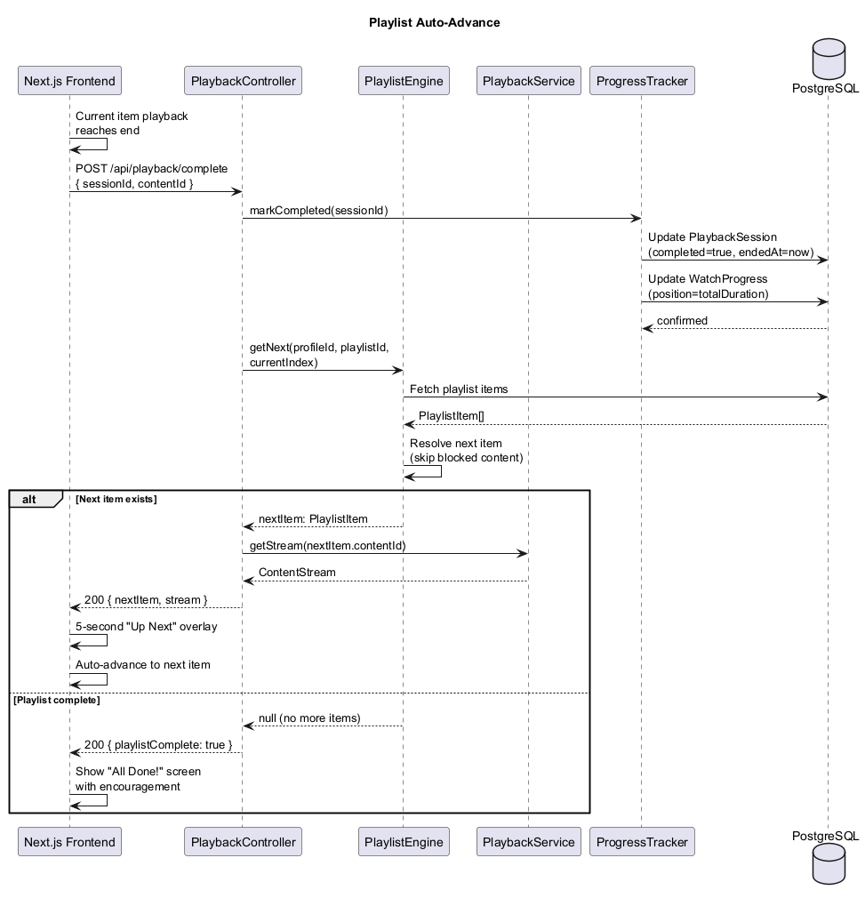
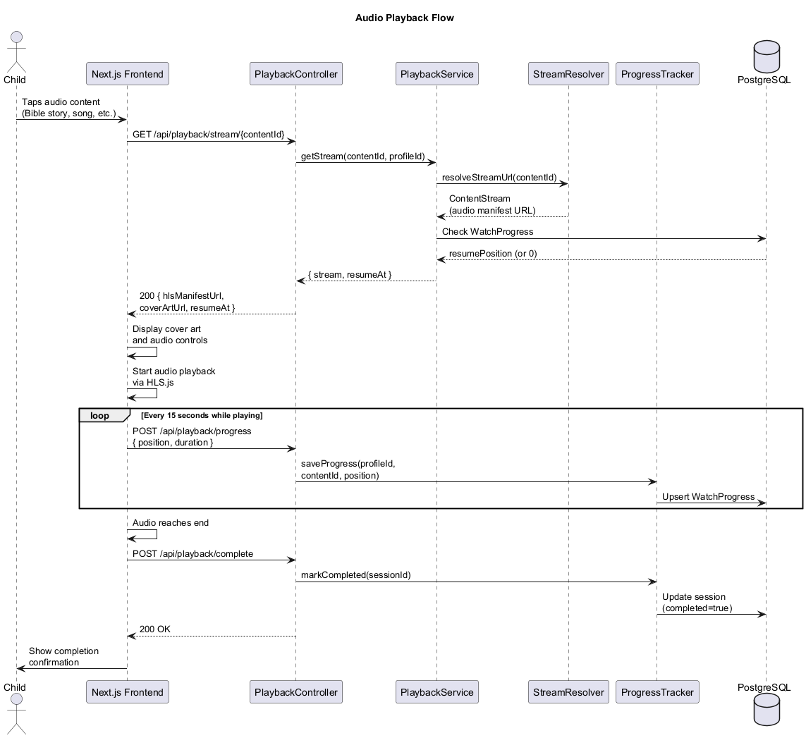
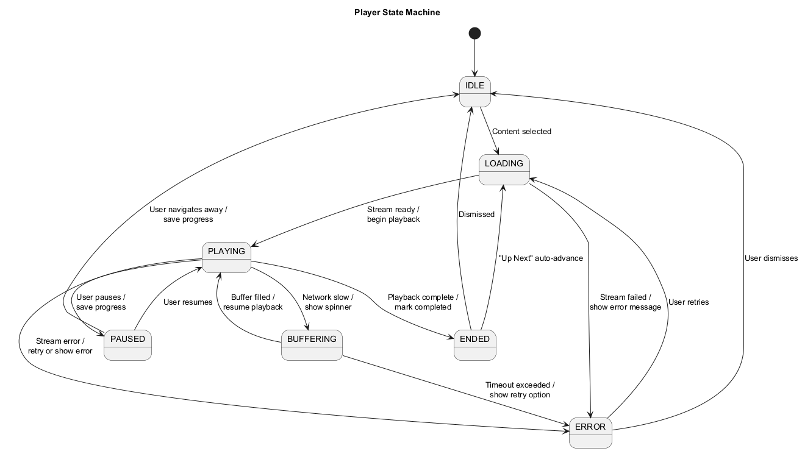

# Playback Feature — Detailed Design

## Overview

The Playback feature provides video and audio streaming for the LightHouse Kids platform. All content is human-curated — there are no ads, no algorithmic recommendations, and no engagement-maximizing dark patterns. The player supports HLS adaptive streaming served from MinIO (or a CDN in production), playlist progression with auto-advance, and persistent progress tracking so children can resume where they left off.

### Key Principles

- **No ads, ever.** The player renders content only — no pre-rolls, mid-rolls, or banners.
- **No algorithmic recommendations.** "Up Next" items come from curated playlists, not ML models.
- **Resume-friendly.** Progress is saved every 15 seconds so children never lose their place.
- **Age-filtered.** Content feeds are pre-filtered by the child's age band before reaching the player.

---

## Architecture

### Component Diagram

Shows the internal components of the Playback module and their relationships to MinIO and PostgreSQL.

---

## Domain Model

### Class Diagram

The core domain entities — `PlaybackSession`, `WatchProgress`, `ContentStream`, `PlaylistItem`, and the `PlayerState` enum.

### Entity Descriptions

| Entity | Purpose |
|---|---|
| `PlaybackSession` | Tracks a single playback event from start to end. Records whether the content was completed. |
| `WatchProgress` | Stores the latest resume point for a given child profile and content item. Updated periodically during playback. |
| `ContentStream` | Represents the resolved streaming URLs and available quality levels for a content item. |
| `PlaylistItem` | A single item within a curated playlist, with ordering and metadata. |
| `PlayerState` | Enum governing the player state machine: IDLE, LOADING, PLAYING, PAUSED, BUFFERING, ENDED, ERROR. |

---

## Key Classes and Interfaces

### PlaybackController (Fastify Route Handler)

Exposes REST endpoints for the frontend player:

- `GET /api/playback/stream/:contentId` — Resolve stream URL and resume point for a content item.
- `POST /api/playback/progress` — Save current playback position (called every 15 seconds).
- `POST /api/playback/complete` — Mark a playback session as completed.
- `GET /api/playback/history/:profileId` — Retrieve playback history for a child profile.

### PlaybackService

Core orchestration layer. Coordinates stream URL resolution, session creation, and progress persistence via Prisma. Delegates URL generation to `StreamResolver` and progress tracking to `ProgressTracker`.

### PlaylistEngine

Resolves the next content item in a playlist. Handles:

- Sequential ordering within curated playlists.
- Skipping content that has been blocked by a parent (integrates with `ContentBlockService`).
- Auto-advance logic with a 5-second "Up Next" preview overlay.
- End-of-playlist handling (shows a friendly "All Done!" screen).

### ProgressTracker

Responsible for saving and loading playback progress:

- Upserts `WatchProgress` records on each periodic save.
- Calculates resume points (skips back 5 seconds from last saved position for context).
- Marks `PlaybackSession` records as completed when playback reaches the end.

### StreamResolver

Resolves content IDs to playable URLs. In development, generates MinIO presigned URLs directly. In production, resolves to CDN-fronted URLs. Returns a `ContentStream` object with the HLS manifest URL, available quality levels, and thumbnail.

---

## Sequence Diagrams

### Start Video Playback

A child taps a content card. The API resolves the stream URL from MinIO/CDN, checks for a resume point, creates a session, and returns everything the frontend needs to initialize the HLS player.

### Playlist Auto-Advance

When the current item ends, the frontend notifies the API. The `PlaylistEngine` resolves the next item, the completed session is recorded, and the frontend shows a 5-second "Up Next" overlay before advancing.

### Audio Playback

Audio content follows the same flow as video but renders a cover art display with audio controls instead of a video surface. Progress tracking and completion work identically.

---

## State Machine

### Player State Transitions

The player follows a strict state machine. All transitions are explicit — the UI renders different components based on the current state.

| Transition | Trigger | Side Effect |
|---|---|---|
| IDLE to LOADING | Content selected | API call initiated |
| LOADING to PLAYING | Stream ready | HLS.js begins playback |
| PLAYING to PAUSED | User tap / parent interrupt | Progress saved |
| PLAYING to BUFFERING | Network degradation | Spinner shown, quality may downgrade |
| PLAYING to ENDED | Playback complete | Session marked complete, "Up Next" shown |
| Any to ERROR | Network failure / stream error | Retry option displayed |

---

## Progress Tracking Details

### Save Strategy

- Progress is saved every **15 seconds** during active playback via `POST /api/playback/progress`.
- On pause, progress is saved immediately.
- On navigation away, a `beforeunload` handler attempts a final save.
- Resume points are calculated as `savedPosition - 5 seconds` to give the child context when returning.

### Completion Criteria

Content is marked as **completed** when the playback position reaches 95% of the total duration. This avoids edge cases where credits or silence at the end prevent completion tracking.

---

## Content Feed and Filtering

Content displayed in the app is pre-filtered by:

1. **Age band** — Only content appropriate for the child's configured age range is shown.
2. **Parental blocks** — Content explicitly blocked by a parent for a specific child is excluded.
3. **Curation** — All content is manually curated and categorized by the LightHouse team. There is no user-generated content and no algorithmic surfacing.

The feed is ordered by curated playlists, not by engagement metrics or watch history patterns.
