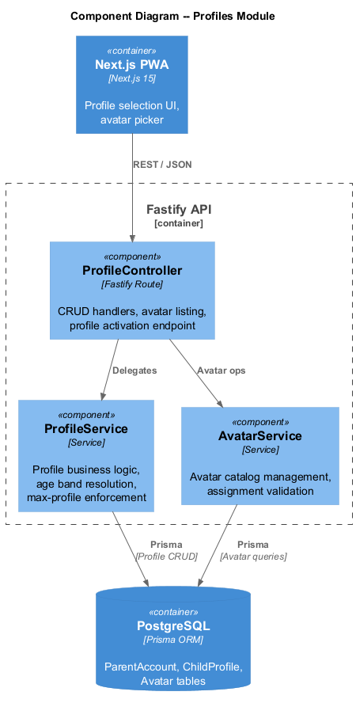
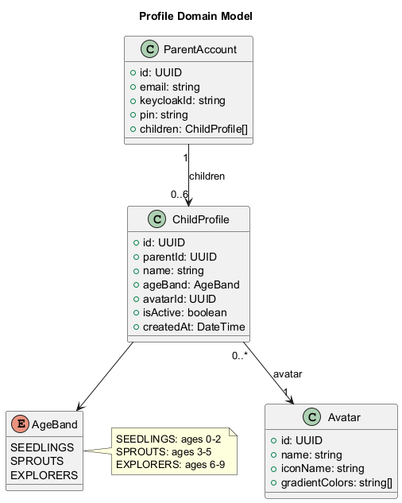
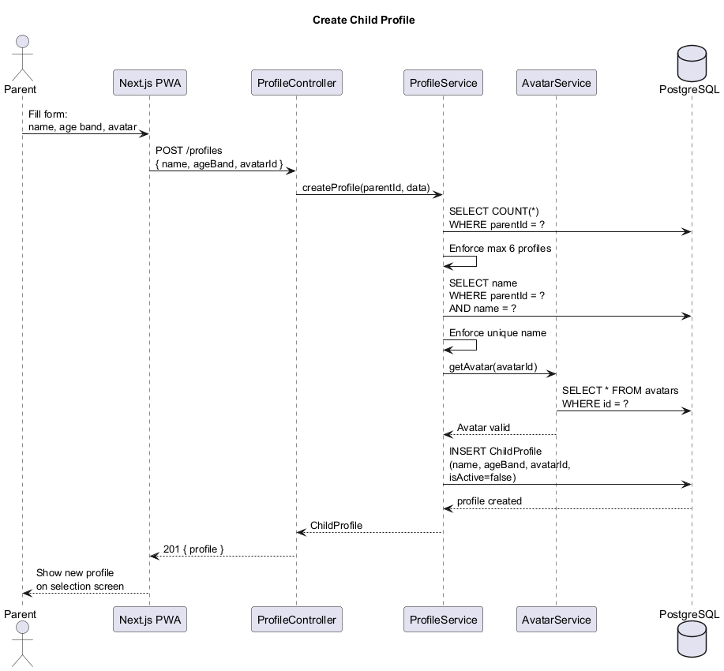
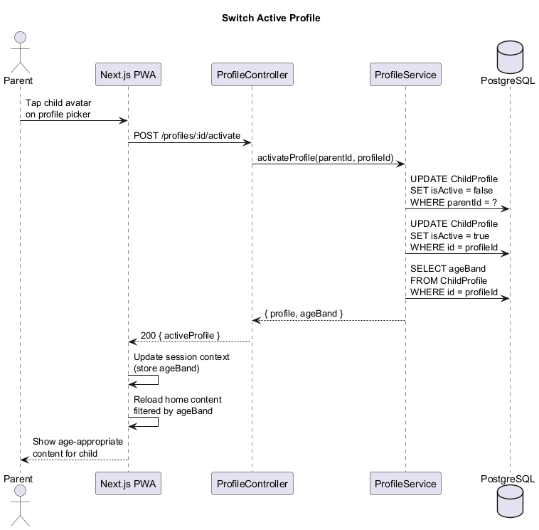
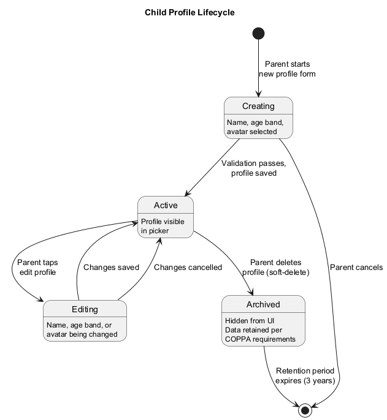

# Profiles -- Detailed Design

## 1. Overview

The Profiles module manages **parent accounts** and **child profiles** within the LightHouse Kids platform. Each parent can create multiple child profiles, each assigned to an **age band** that determines content filtering. Children select from a curated set of **avatars** for a friendly, personalized experience. Profile switching updates the session context so all content is filtered by the active child's age band.

Key capabilities:

- Parent account links to Keycloak identity and holds the parental PIN.
- Child profile CRUD with age-band assignment and avatar selection.
- Three age bands: **Seedlings** (0-2), **Sprouts** (3-5), **Explorers** (6-9).
- Six or more avatar options with icon names and gradient color themes.
- Profile switching updates session context and triggers content reload.

---

## 2. Architecture Diagrams

### 2.1 API Components (C4 Level 3)

---

## 3. Domain Model

### 3.1 Class Diagram

### 3.2 Entities

#### ParentAccount

| Field      | Type     | Description                          |
|------------|----------|--------------------------------------|
| id         | UUID     | Primary key                          |
| email      | string   | Unique email address                 |
| keycloakId | string   | Keycloak user ID                     |
| pin        | string   | Hashed parental gate PIN             |
| children   | array    | Related ChildProfile records         |

#### ChildProfile

| Field     | Type     | Description                          |
|-----------|----------|--------------------------------------|
| id        | UUID     | Primary key                          |
| parentId  | UUID     | FK to ParentAccount                  |
| name      | string   | Display name (max 20 chars)          |
| ageBand   | AgeBand  | SEEDLINGS, SPROUTS, or EXPLORERS     |
| avatarId  | UUID     | FK to Avatar                         |
| isActive  | boolean  | Currently selected profile           |
| createdAt | DateTime | Profile creation timestamp           |

#### Avatar

| Field          | Type     | Description                          |
|----------------|----------|--------------------------------------|
| id             | UUID     | Primary key                          |
| name           | string   | Display name (e.g., "Sunny Lion")    |
| iconName       | string   | Icon identifier for the frontend     |
| gradientColors | string[] | CSS gradient color pair              |

### 3.3 Enums

#### AgeBand

| Value      | Age Range | Description                               |
|------------|-----------|-------------------------------------------|
| SEEDLINGS  | 0-2       | Simplest content; sensory, musical         |
| SPROUTS    | 3-5       | Short stories, singalongs, basic prayers   |
| EXPLORERS  | 6-9       | Longer devotionals, activities, quizzes    |

---

## 4. Components

### 4.1 ProfileController

| Endpoint                          | Method | Description                          |
|-----------------------------------|--------|--------------------------------------|
| `/profiles`                       | GET    | List child profiles for current parent |
| `/profiles`                       | POST   | Create a new child profile           |
| `/profiles/:id`                   | GET    | Get profile details                  |
| `/profiles/:id`                   | PUT    | Update profile (name, ageBand, avatar) |
| `/profiles/:id`                   | DELETE | Archive (soft-delete) a profile      |
| `/profiles/:id/activate`          | POST   | Set as the active profile            |
| `/profiles/avatars`               | GET    | List available avatars               |

### 4.2 ProfileService

- `createProfile(parentId, data)` -- validates age band, assigns avatar, enforces max-profile limit (6).
- `updateProfile(profileId, data)` -- updates name, age band, or avatar.
- `archiveProfile(profileId)` -- soft-deletes; retains data for COPPA compliance.
- `activateProfile(parentId, profileId)` -- deactivates other profiles, sets this one active.
- `resolveAgeBand(birthDate)` -- calculates age band from birth date if provided.

### 4.3 AvatarService

- `listAvatars()` -- returns all available avatars from the catalog.
- `getAvatar(avatarId)` -- returns a single avatar by ID.
- `assignAvatar(profileId, avatarId)` -- validates avatar exists and assigns to profile.

Default avatar catalog (seeded):

| Name           | Icon            | Gradient              |
|----------------|-----------------|----------------------|
| Sunny Lion     | `lion`          | `#FFD700, #FFA500`   |
| Gentle Lamb    | `lamb`          | `#FFF0F5, #FFB6C1`   |
| Brave Eagle    | `eagle`         | `#87CEEB, #4682B4`   |
| Wise Owl       | `owl`           | `#DDA0DD, #9370DB`   |
| Happy Dolphin  | `dolphin`       | `#00CED1, #20B2AA`   |
| Joyful Sparrow | `sparrow`       | `#98FB98, #3CB371`   |

---

## 5. Sequence Diagrams

### 5.1 Create Child Profile

### 5.2 Switch Active Profile

---

## 6. State Diagram

### 6.1 Profile Lifecycle

---

## 7. Business Rules

1. **Max profiles**: A parent may create up to 6 child profiles.
2. **Name uniqueness**: Profile names must be unique within a parent account.
3. **Consent required**: Child profiles cannot be created until COPPA consent is verified.
4. **Age band immutability**: Once set, the age band can only be changed by the parent (not auto-updated by age).
5. **Active profile**: Exactly one profile is active per session. Activating one deactivates the others.
6. **Archival**: Archived profiles are hidden from the UI but retained in the database for 3 years per COPPA data-retention requirements.
