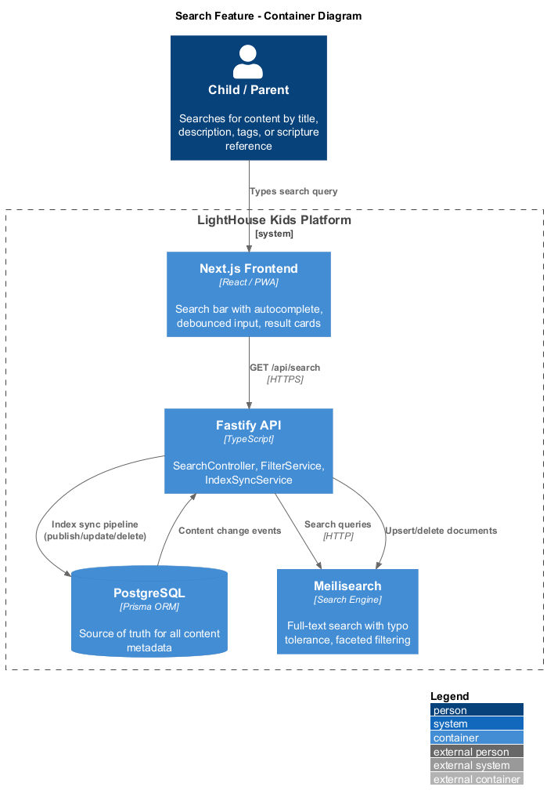
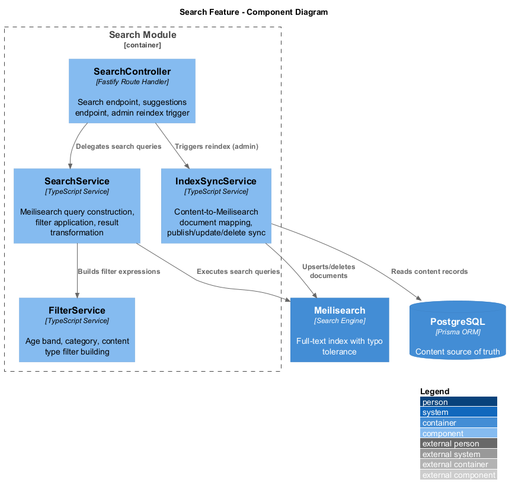
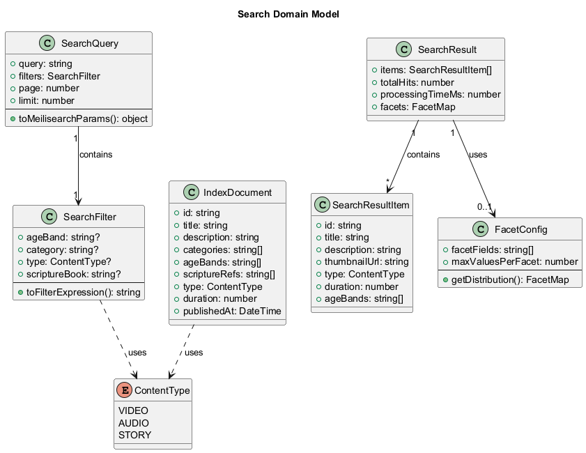
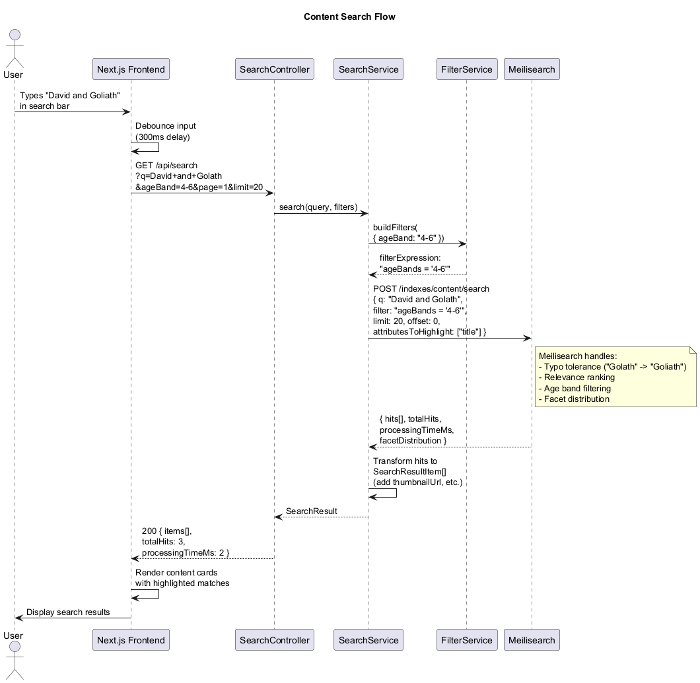
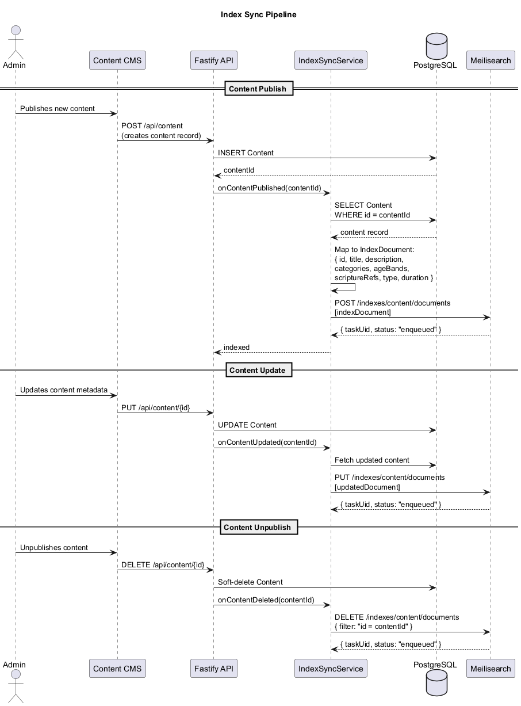

# Search Feature — Detailed Design

## Overview

The Search feature provides content discovery powered by Meilisearch. Users can search by title, description, tags, and scripture references (book + chapter:verse). Results are filtered by age band, category, and content type. Meilisearch provides typo tolerance, fast full-text search, and faceted filtering. An index sync pipeline keeps the Meilisearch index consistent with PostgreSQL (the source of truth) whenever content is published, updated, or unpublished.

### Key Principles

- **PostgreSQL is the source of truth.** Meilisearch is a read-optimized projection. All content is authored and stored in PostgreSQL; the search index is derived.
- **Age-band filtering is mandatory.** Every search query includes the child's age band as a filter. Children never see content outside their configured age range.
- **Typo-tolerant.** Meilisearch handles misspellings gracefully (e.g., "Golath" matches "Goliath"), which is especially important for young users who are still learning to spell.
- **No algorithmic ranking manipulation.** Search results are ranked by Meilisearch's default relevance algorithm — no engagement-based boosting.

---

## Architecture

### Container Diagram

Shows the high-level relationship between the API, Meilisearch, and PostgreSQL in the search flow.



### Component Diagram

Shows the internal components of the Search module within the Fastify API.



---

## Domain Model

### Class Diagram

The core domain types — `SearchQuery`, `SearchFilter`, `SearchResult`, `IndexDocument`, and `FacetConfig`.



### Type Descriptions

| Type | Purpose |
|---|---|
| `SearchQuery` | Encapsulates a search request: the query string, filters, pagination. Provides a `toMeilisearchParams()` method. |
| `SearchFilter` | Filter criteria: age band, category, content type, scripture book. Produces a Meilisearch filter expression string. |
| `ContentType` | Enum: VIDEO, AUDIO, STORY. Used for type-based filtering. |
| `SearchResult` | The response object: matching items, total hit count, processing time, and facet distribution. |
| `SearchResultItem` | A single search hit with display-ready fields: title, description, thumbnail, type, duration, age bands. |
| `IndexDocument` | The Meilisearch document schema. Maps from the PostgreSQL content record to the fields indexed for search. |
| `FacetConfig` | Defines which fields are faceted and how facet distributions are returned in results. |

---

## Key Classes and Interfaces

### SearchController (Fastify Route Handler)

Exposes REST endpoints:

- `GET /api/search?q=&ageBand=&category=&type=&page=&limit=` — Full-text content search with filters and pagination.
- `GET /api/search/suggestions?q=&ageBand=` — Autocomplete suggestions (returns top 5 matching titles).
- `POST /api/search/reindex` — Admin-only endpoint to trigger a full reindex from PostgreSQL to Meilisearch.

### SearchService

Core search orchestration:

- **Query construction:** Builds Meilisearch search parameters from a `SearchQuery`, including filter expressions, pagination, and highlight configuration.
- **Filter application:** Delegates to `FilterService` to build Meilisearch-compatible filter strings.
- **Result transformation:** Maps Meilisearch hits to `SearchResultItem` objects, resolving thumbnail URLs and formatting metadata for the frontend.
- **Suggestions:** Executes a lightweight search with `limit: 5` and returns only titles for autocomplete.

### IndexSyncService

Keeps Meilisearch in sync with PostgreSQL:

- **Publish sync:** When content is published, maps the PostgreSQL record to an `IndexDocument` and upserts it to Meilisearch.
- **Update sync:** When content metadata changes, re-maps and upserts the updated document.
- **Delete sync:** When content is unpublished (soft-deleted), removes the document from the Meilisearch index.
- **Full reindex:** Reads all published content from PostgreSQL, maps each to an `IndexDocument`, and batch-upserts to Meilisearch. Used for initial setup or recovery.

### FilterService

Builds Meilisearch filter expressions:

- **Age band filter:** `ageBands = '4-6'` — ensures results match the child's configured age range.
- **Category filter:** `categories = 'Bible Stories'` — narrows by content category.
- **Type filter:** `type = 'VIDEO'` — filters by content type.
- **Scripture filter:** `scriptureRefs = 'Genesis'` — finds content referencing a specific book of the Bible.
- **Compound filters:** Combines multiple filters with AND logic.

---

## Sequence Diagrams

### Content Search

A user types a query, the frontend debounces input (300ms), sends the request to the API, which queries Meilisearch with age-band filtering and typo tolerance, then returns results rendered as content cards.



### Index Sync Pipeline

Content lifecycle events (publish, update, unpublish) trigger the sync pipeline, which maps PostgreSQL records to Meilisearch documents and upserts or deletes them.



---

## Meilisearch Configuration

### Index Settings

```json
{
  "index": "content",
  "primaryKey": "id",
  "searchableAttributes": [
    "title",
    "description",
    "categories",
    "scriptureRefs"
  ],
  "filterableAttributes": [
    "ageBands",
    "categories",
    "type",
    "scriptureRefs"
  ],
  "sortableAttributes": [
    "publishedAt",
    "title"
  ],
  "typoTolerance": {
    "enabled": true,
    "minWordSizeForTypos": {
      "oneTypo": 4,
      "twoTypos": 8
    }
  }
}
```

### Index Document Schema

Each document in the Meilisearch `content` index maps to an `IndexDocument`:

| Field | Type | Searchable | Filterable | Notes |
|---|---|---|---|---|
| `id` | string | No | No | Primary key. Matches PostgreSQL content ID. |
| `title` | string | Yes | No | Content title. Highest search weight. |
| `description` | string | Yes | No | Content description. |
| `categories` | string[] | Yes | Yes | e.g., ["Bible Stories", "Old Testament"] |
| `ageBands` | string[] | No | Yes | e.g., ["0-3", "4-6"] |
| `scriptureRefs` | string[] | Yes | Yes | e.g., ["Genesis 1:1", "John 3:16"] |
| `type` | string | No | Yes | VIDEO, AUDIO, or STORY |
| `duration` | number | No | No | Duration in seconds |
| `publishedAt` | DateTime | No | No | Used for sort-by-newest |

---

## Scripture Reference Search

Scripture references are stored as strings in the format `"Book Chapter:Verse"` (e.g., `"Genesis 1:1"`, `"John 3:16"`). This allows users to search for content by:

- **Book name:** Searching "Genesis" returns all content referencing Genesis.
- **Specific reference:** Searching "John 3:16" returns content tied to that verse.
- **Partial matches:** Searching "Psalm" matches "Psalm 23:1", "Psalm 119:105", etc.

The `scriptureRefs` field is both searchable (so it appears in full-text results) and filterable (so it can be used as a facet filter).

---

## Frontend Integration

### Debouncing

Search input is debounced at **300ms** to avoid excessive API calls while the user is typing. Suggestions (autocomplete) use the same debounce interval.

### Autocomplete

As the user types, the frontend calls `GET /api/search/suggestions` to show a dropdown of up to 5 matching titles. Selecting a suggestion navigates directly to that content item.

### Result Display

Search results are rendered as content cards showing:
- Thumbnail image
- Title (with highlighted matching terms)
- Content type badge (Video / Audio / Story)
- Duration
- Age band indicator

### Empty States

- **No results:** "We couldn't find anything for [query]. Try a different search!"
- **No query:** The search page shows curated category browsing instead of an empty state.
